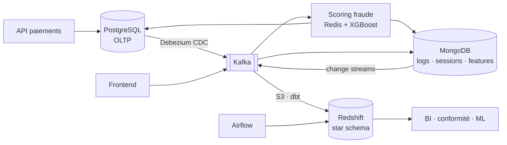

# Stripe — Architecture de données OLTP · OLAP · NoSQL

Business case Jedha (Data Engineering) : conception d'une architecture de données complète pour Stripe, intégrant un système transactionnel (PostgreSQL), un entrepôt analytique (Amazon Redshift) et une base documentaire (MongoDB), reliés par un pipeline CDC / Kafka / dbt / Airflow, avec un plan de sécurité-conformité (PCI-DSS, RGPD, CCPA) et l'intégration de modèles de machine learning (fraude temps réel, personnalisation, prédictif).

*English summary: end-to-end data architecture for a payment platform — normalized OLTP schema (PostgreSQL), Kimball star schema (Redshift), document model (MongoDB), CDC streaming + batch pipeline (Debezium, Kafka, dbt, Airflow), security & compliance plan, ML integration. Everything runs locally with Docker; all 30 queries are executed against synthetic data.*



---

## Livrables

| # | Livrable de l'énoncé | Document | Artefacts |
|---|---|---|---|
| — | Synthèse exécutive | [docs/00_executive_summary.md](docs/00_executive_summary.md) | |
| 1 | Diagramme d'architecture global | [docs/01_architecture.md](docs/01_architecture.md) | flux, choix technologiques, fil rouge |
| 2 | ERD OLTP | [docs/02_oltp_erd.md](docs/02_oltp_erd.md) | [`schemas/oltp_dbdiagram.txt`](schemas/oltp_dbdiagram.txt) · [PNG](schemas/exports/oltp_dbdiagram.png) · [`sql/ddl_oltp.sql`](sql/ddl_oltp.sql) |
| 3 | Schéma OLAP | [docs/03_olap_schema.md](docs/03_olap_schema.md) | [`schemas/olap_dbdiagram.txt`](schemas/olap_dbdiagram.txt) · [PNG](schemas/exports/olap_dbdiagram.png) · [`sql/ddl_olap.sql`](sql/ddl_olap.sql) · [`build_olap.py`](build_olap.py) |
| 4 | Modèle NoSQL | [docs/04_nosql_model.md](docs/04_nosql_model.md) | [`schemas/nosql_schema.json`](schemas/nosql_schema.json) · [`scripts/mongo_init.js`](scripts/mongo_init.js) |
| 5 | Architecture du pipeline | [docs/05_pipeline.md](docs/05_pipeline.md) | [`pipeline/`](pipeline/) (Debezium, dbt, Airflow) |
| 6 | Sécurité & conformité | [docs/06_security_compliance.md](docs/06_security_compliance.md) | DDL (audit, vues), DAG d'effacement, tests dbt |
| 7 | Intégration ML | [docs/07_ml_integration.md](docs/07_ml_integration.md) | [`ml/train_fraud_demo.py`](ml/train_fraud_demo.py) |
| 8 | Requêtes SQL & NoSQL | [docs/08_queries.md](docs/08_queries.md) | [`queries/`](queries/) · résultats dans [`docs/results/`](docs/results/) |
| — | Données synthétiques | [docs/09_data_generation.md](docs/09_data_generation.md) | [`generate_data.py`](generate_data.py) · [`data/`](data/) |
| — | Glossaire | [docs/glossaire.md](docs/glossaire.md) | |

Les diagrammes sont en Mermaid (rendu natif GitHub) ; les ERD sont aussi exportés en PNG dans `schemas/exports/`, et les schémas dbdiagram.io se collent tels quels sur https://dbdiagram.io.

---

## Stack

| Besoin | Outil | Pourquoi (détail dans 01) |
|---|---|---|
| OLTP | PostgreSQL 16 | ACID, partitionnement déclaratif, réplication logique pour le CDC, `inet`/`jsonb` |
| OLAP | Amazon Redshift | Star schema, `DISTKEY`/`SORTKEY`, MV `AUTO REFRESH`, dialecte PostgreSQL |
| NoSQL | MongoDB 7 | Documents imbriqués, time-series, TTL, sharding, change streams, transactions |
| Streaming | Debezium + Apache Kafka + Schema Registry | CDC sur le WAL, replay, multi-consommateurs |
| Transformation | dbt | SQL versionné, snapshots SCD2, tests, lineage |
| Orchestration | Apache Airflow | DAGs quotidiens / mensuels / à la demande |
| Cache & features online | Redis | < 1 ms pour le scoring |
| ML | XGBoost, SHAP, MLflow, Evidently | fraude < 200 ms, explicabilité, registry, drift |
| Données synthétiques | Python — Faker, pandas, NumPy | aucune donnée réelle |

---

## Lancer la démo

Prérequis : Docker Desktop, Python 3.11+.

```bash
# 1. Données (déjà versionnées dans data/ — cette étape est optionnelle)
python -m venv venv && source venv/bin/activate     # Windows : venv\Scripts\activate
pip install -r requirements.txt
python generate_data.py && python build_olap.py

# 2. Stack + chargement + exécution des 30 requêtes
bash scripts/demo.sh
#   → docs/results/oltp_results.txt, olap_results.txt, nosql_results.txt

# 3. Explorer
docker exec -it stripe-postgres psql -U stripe -d stripe_oltp     # OLTP
docker exec -it stripe-postgres psql -U stripe -d stripe_olap     # OLAP (simulation Redshift)
docker exec -it stripe-mongo mongosh stripe_nosql                 # NoSQL

# 4. Mini-modèle de fraude (optionnel)
python ml/train_fraud_demo.py

# Arrêt
docker compose -f docker/dev/docker-compose.yml down -v
```

---

## Structure du dépôt

```
├── README.md
├── docs/                      ← livrables 00 → 09, glossaire, results/
├── schemas/                   ← dbdiagram.io (OLTP, OLAP) + JSON (NoSQL) + exports/ (PNG)
├── sql/                       ← DDL et chargement OLTP / OLAP
├── queries/                   ← 10 requêtes OLTP, 10 OLAP, 10 NoSQL
├── pipeline/
│   ├── kafka/                 ← connecteur Debezium
│   ├── dbt/                   ← modèles staging / intermediate / marts, snapshot SCD2, tests
│   └── dags/                  ← Airflow : agrégats quotidiens, droit à l'oubli
├── ml/                        ← démo XGBoost + SHAP + MLflow
├── scripts/                   ← demo.sh, mongo_init.js
├── docker/dev/                ← docker-compose (PostgreSQL + MongoDB)
├── data/                      ← CSV OLTP, JSON MongoDB, CSV OLAP (générés)
├── generate_data.py           ← génération synthétique
├── build_olap.py              ← construction du star schema (simulation dbt)
└── requirements.txt
```

---

Emeline Roblot — Jedha, 2026.
