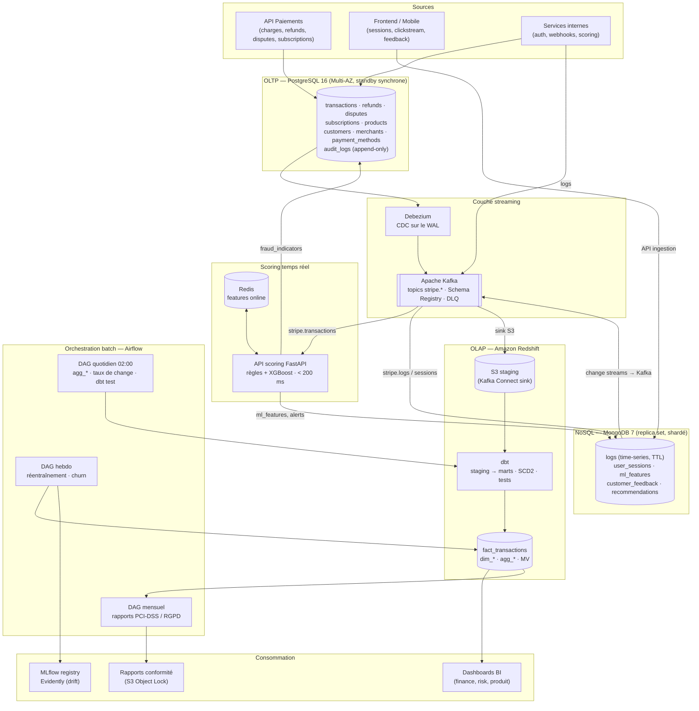
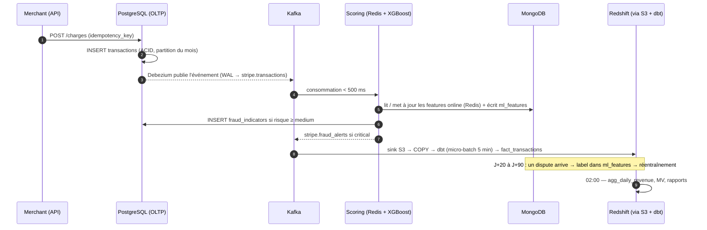

# 01 — Architecture de données globale

> Livrable 1 de l'énoncé : *Comprehensive Data Architecture Diagram* — intégration OLTP, OLAP et NoSQL, flux, pipelines et modèles.

---

## 1. Vue d'ensemble

Trois systèmes, chacun choisi pour ce qu'il fait le mieux, reliés par un bus d'événements unique :

| Système | Rôle | Technologie | Modèle | Garantie |
|---|---|---|---|---|
| **OLTP** | Source de vérité des paiements | PostgreSQL 16 | 3NF, partitionné | ACID, cohérence forte |
| **OLAP** | Analytique, reporting, entraînement ML | Amazon Redshift | Star schema (Kimball) | Cohérence à terme (< 5 min) |
| **NoSQL** | Logs, clickstream, features ML, feedback | MongoDB 7 | Documents, time-series | Cohérence à terme, flexible |
| **Bus** | Découplage producteurs / consommateurs | Apache Kafka + Debezium (CDC) | Événements Avro | At-least-once + idempotence = exactly-once effectif |

---

## 2. Fil rouge : la vie d'une transaction

Suivre une seule transaction à travers toute l'architecture est le meilleur moyen de la comprendre.

| Étape | Latence cible | Garantie |
|---|---|---|
| Écriture OLTP | < 10 ms | ACID, `idempotency_key` unique |
| OLTP → Kafka (CDC) | < 500 ms | Ordre par clé de partition `merchant_id` |
| Kafka → scoring → décision | < 200 ms (P95) | Dégradation gracieuse : score par défaut si timeout |
| Kafka → MongoDB | < 1 s | `writeConcern: majority` pour ml_features |
| Kafka → Redshift (star schema) | < 5 min | Upsert idempotent sur `transaction_id` |
| Agrégats & rapports | quotidien / mensuel | dbt tests bloquants |

---

## 3. Flux de données

| # | Flux | Direction | Outil | Mode | Latence |
|---|---|---|---|---|---|
| F1 | Transactions, refunds, disputes, subscriptions, merchants, customers | OLTP → Kafka | Debezium (CDC WAL) | Streaming | < 500 ms |
| F2 | Scoring fraude | Kafka → API scoring → OLTP + MongoDB | Consumer Python + FastAPI | Streaming | < 200 ms |
| F3 | Logs, sessions | Services / Frontend → Kafka → MongoDB | Kafka Connect MongoDB sink | Streaming | < 1 s |
| F4 | Événements OLTP | Kafka → S3 → Redshift staging | Kafka Connect S3 sink + COPY | Micro-batch | < 2 min |
| F5 | Staging → star schema | Redshift interne | dbt (modèles incrémentaux, snapshots SCD2) | Micro-batch | < 5 min |
| F6 | Sessions, feedback, prédictions | MongoDB → Kafka → Redshift | Change streams (connecteur Debezium MongoDB) | Streaming | < 5 min |
| F7 | Agrégations, segments clients | Redshift interne | Airflow + dbt | Batch nuit | quotidien |
| F8 | Taux de change | API BCE → OLTP + Redshift | Airflow | Batch | quotidien 06:00 |
| F9 | Dataset d'entraînement | Redshift + MongoDB → MLflow | Airflow | Batch | hebdo |
| F10 | Rapports de conformité | Redshift → S3 Object Lock → Legal | Airflow | Batch | mensuel |
| F11 | Droit à l'oubli | Demande → OLTP + Redshift + MongoDB | Airflow `dag_right_to_erasure` | À la demande | < 72 h |

---

## 4. Choix technologiques et alternatives écartées

| Besoin | Choix | Alternative écartée | Pourquoi |
|---|---|---|---|
| OLTP | **PostgreSQL 16** | MySQL, CockroachDB | Réplication logique native pour Debezium, partitionnement déclaratif, `inet`/`jsonb`, extension Citus si sharding requis. CockroachDB apporte la distribution native mais au prix d'une latence d'écriture supérieure (consensus Raft) — inutile tant que le partitionnement + read replicas suffisent. |
| OLAP | **Amazon Redshift** | BigQuery, Snowflake | Dialecte PostgreSQL (portabilité des requêtes et des compétences), DISTKEY/SORTKEY pour co-localiser les jointures, cohérence de l'écosystème AWS déjà retenu pour la sécurité (KMS, S3 Object Lock, Secrets Manager, MSK). BigQuery reste l'alternative crédible si l'entreprise est sur GCP. |
| NoSQL | **MongoDB 7** | Cassandra, DynamoDB | Modèle document adapté aux events imbriqués et aux features à schéma variable ; time-series collections, TTL, change streams, transactions multi-documents, validation `$jsonSchema`. Cassandra excelle en écriture massive mais impose de modéliser par requête et n'a ni agrégation riche ni transactions. |
| CDC | **Debezium** | Polling `updated_at`, triggers | Lit le WAL sans charge sur les tables, capte les DELETE, ordre garanti, snapshot initial. |
| Bus | **Kafka (MSK)** | RabbitMQ, SQS, Kinesis | Replay depuis un offset, multi-consommateurs, rétention, partitions ordonnées par clé, Schema Registry. |
| Transformation | **dbt** | Spark | SQL natif sur Redshift, tests intégrés, snapshots SCD2, lineage et docs générés. Spark serait justifié pour du non-SQL massif (features ML lourdes). |
| Orchestration | **Airflow (MWAA)** | Prefect, Dagster | Standard de l'industrie, opérateurs dbt/Redshift/Mongo, SLA et alerting natifs. |
| Feature store online | **Redis** | MongoDB seul | Lecture < 1 ms pour respecter le budget de 200 ms ; MongoDB reste le store de référence des features et des prédictions. |
| Registry / monitoring ML | **MLflow + Evidently** | SageMaker Model Registry | Open source, indépendant du cloud, intégration XGBoost native. |

---

## 5. Propriétés garanties par système

| Propriété | OLTP (PostgreSQL) | OLAP (Redshift) | NoSQL (MongoDB) |
|---|---|---|---|
| Cohérence | Forte (ACID, `REPEATABLE READ`) | À terme (< 5 min), idempotente | À terme ; `majority` sur les écritures critiques ; transactions multi-documents disponibles |
| Scalabilité | Verticale + partitions + read replicas ; Citus pour sharder par `merchant_id` | Horizontale (MPP, RA3), concurrency scaling | Horizontale (sharding par clé hashée) |
| Haute disponibilité | Standby synchrone Multi-AZ, failover automatique (RPO ≈ 0, RTO < 60 s) | Multi-AZ, snapshots automatiques | Replica set 3 nœuds multi-AZ, élection automatique |
| Latence lecture | < 10 ms (index) | secondes (agrégats), < 1 s via agg_*/MV | < 50 ms (index), < 1 ms via Redis |
| Rétention | Illimitée (partitions archivées vers S3 après 24 mois) | Illimitée | TTL par collection (30 j → illimité anonymisé) |
| Chiffrement | AES-256 (KMS) + TLS 1.3, `pgcrypto` colonne | AES-256 (KMS) + TLS 1.3, masquage dynamique | AES-256 (KMS) + TLS 1.3, CSFLE champ |

---

## 6. Scalabilité : indexation, partitionnement, cache — par système

| Système | Indexation | Partitionnement / distribution | Cache |
|---|---|---|---|
| PostgreSQL | B-tree composites alignés sur les requêtes, index partiels (`WHERE status = 'failed'`), index sur FK | RANGE mensuel sur `transactions.created_at` (pruning, archivage par `DETACH`), Citus par `merchant_id` au-delà de ~5 To | PgBouncer (pooling), `shared_buffers`, Redis pour les lectures chaudes (profil client, limites) |
| Kafka | — | Partitions par `merchant_id` (ordre par merchant), 24-48 partitions/topic, consumer groups | Rétention 7 j = tampon en cas de panne aval |
| Redshift | Zone maps via SORTKEY `date_sk` | DISTKEY `merchant_sk` (jointures co-localisées), dimensions `DISTSTYLE ALL` | Result cache, `agg_*`, vues matérialisées `AUTO REFRESH` |
| MongoDB | Composés selon la règle ESR, TTL, multikey, text | Shard keys hashées (`customer_id`, `transaction_id`), zone sharding par région (résidence des données) | WiredTiger cache, Redis devant pour les features online |

Le détail par livrable : [02_oltp_erd.md](02_oltp_erd.md), [03_olap_schema.md](03_olap_schema.md), [04_nosql_model.md](04_nosql_model.md), [05_pipeline.md](05_pipeline.md), [06_security_compliance.md](06_security_compliance.md), [07_ml_integration.md](07_ml_integration.md), [08_queries.md](08_queries.md).
