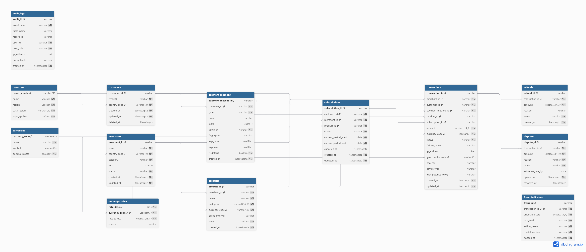
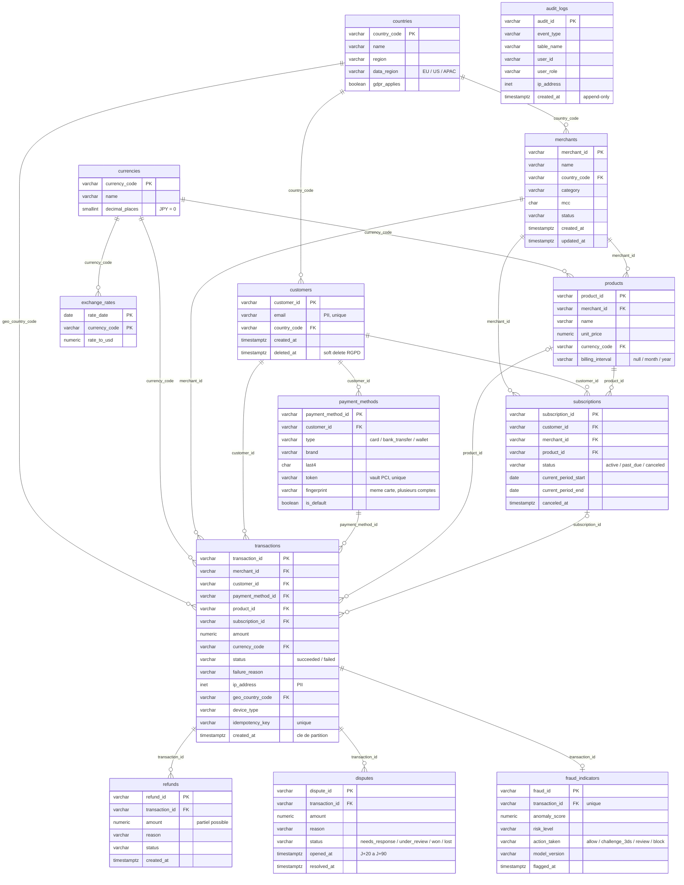

# 02 — Modèle OLTP : ERD normalisé (PostgreSQL)

> Livrable 2 : *ERD for OLTP System* — schéma normalisé, intégrité transactionnelle, performance, réplication et failover.

- Code dbdiagram.io : [`schemas/oltp_dbdiagram.txt`](../schemas/oltp_dbdiagram.txt) (à coller sur https://dbdiagram.io) — export : [`schemas/exports/oltp_dbdiagram.png`](../schemas/exports/oltp_dbdiagram.png)
- DDL exécutable : [`sql/ddl_oltp.sql`](../sql/ddl_oltp.sql)
- Démo : `bash scripts/demo.sh` → base `stripe_oltp`

---

## 1. Diagramme entité-relation



Version Mermaid (rendu GitHub) :



13 tables organisées en 4 couches :

```
Référence     → countries, currencies, exchange_rates
Métier        → merchants, customers, payment_methods, products, subscriptions
Transactions  → transactions (centrale, partitionnée) ← refunds, disputes, fraud_indicators
Gouvernance   → audit_logs (append-only)
```

---

## 2. Couverture des workloads de l'énoncé

| Workload énoncé | Modélisation |
|---|---|
| Payments | `transactions` (statut `succeeded` / `failed` + `failure_reason`) |
| Refunds | `refunds` — relation 1-N : plusieurs remboursements partiels par transaction |
| Chargebacks | `disputes` — un chargeback **n'est pas un statut** de transaction : la transaction reste `succeeded`, le litige vit sa propre vie (`needs_response` → `won` / `lost`), arrive 20-90 jours plus tard et fournit la vérité terrain du modèle de fraude |
| Subscription management | `products.billing_interval` + `subscriptions` (période courante, annulation) ; chaque prélèvement est une `transaction` liée par `subscription_id` |
| Fraud indicators | `fraud_indicators` 1-1 optionnel : score, niveau, **action prise** (allow / 3DS / review / block), version du modèle |
| Location (IP-based) | `ip_address` (type `inet`) + `geo_country_code` / `geo_city` enrichis à l'ingestion (MaxMind) |
| Reference data | `countries` (avec **résidence des données** et RGPD), `currencies` (décimales), `exchange_rates` quotidien, `products` (catalogue) |

---

## 3. Pourquoi ce modèle est en 3NF

- Chaque attribut dépend de la clé, de toute la clé et rien que de la clé. Aucune redondance : le nom du merchant n'existe qu'en un endroit, le pays n'est stocké que par son code.
- `payment_methods` est séparé de `customers` (1-N) : un client a plusieurs cartes / wallets.
- `products` est séparé de `transactions` : le prix et le nom d'un produit changent ; la transaction fige le `amount` payé.
- `refunds` et `disputes` sont séparés de `transactions` : plusieurs remboursements partiels, cycle de vie propre du litige.
- `fraud_indicators` est séparé (1-1 optionnel) : ~10 % des transactions ont un indicateur ; garder ces colonnes dans `transactions` créerait des `NULL` massifs et grossirait la table la plus chaude.
- `exchange_rates` est une table de référence à part : les taux servent à plusieurs tables et sont mis à jour par un job indépendant.

**Ce que l'on dénormalise volontairement :** `transactions.amount` et `currency_code` (figés au moment du paiement, même si le produit change de prix) et `geo_country_code` (dérivé de l'IP, mais indexable). C'est la dénormalisation minimale nécessaire à la traçabilité comptable.

---

## 4. Types et contraintes

| Colonne | Type | Raison |
|---|---|---|
| `*_id` | `varchar` préfixé (`ch_`, `cus_`, `mer_`…) | Convention Stripe : l'ID est lisible, non séquentiel (pas d'énumération par un attaquant), généré côté application |
| `amount` | `numeric(14,2)` | **Jamais `float`** pour de l'argent. `currencies.decimal_places` documente les devises sans centimes (JPY) ; l'alternative « entier en unités mineures » (choix réel de Stripe) est valable mais moins lisible pour l'analyse |
| `status`, `risk_level`, `action_taken`… | `varchar` + `CHECK (... IN (...))` | Contrainte forte comme un `ENUM`, mais un nouveau statut = `ALTER TABLE … DROP/ADD CONSTRAINT` sans réécriture de la table |
| `ip_address` | `inet` | Validation native, opérateurs réseau, troncature `/24` en une fonction (`set_masklen`) pour la pseudonymisation |
| `created_at` | `timestamptz` | Toujours en UTC avec fuseau ; indispensable pour une entreprise multi-juridictions |
| `idempotency_key` | `varchar UNIQUE` | Un rejeu de requête API (timeout réseau) ne peut pas créer deux débits |
| `token` | `varchar NOT NULL UNIQUE` | Référence opaque vers le vault PCI ; le PAN et le CVV n'existent nulle part dans ce schéma |
| `anomaly_score` | `numeric(5,4)` + `CHECK BETWEEN 0 AND 1` | Probabilité à 4 décimales, bornée |

Contraintes métier encodées dans le DDL :
- `CHECK ((status = 'failed') = (failure_reason IS NOT NULL))` : un échec a toujours une raison, un succès jamais.
- `CHECK ((status IN ('won','lost')) = (resolved_at IS NOT NULL))` sur `disputes`.
- Trigger `assert_transaction_exists` sur `refunds`, `disputes`, `fraud_indicators` : intégrité référentielle vers la table partitionnée (une FK classique devrait inclure la clé de partition).
- Trigger `audit_logs_immutable` : `UPDATE` et `DELETE` lèvent une exception, même pour un superutilisateur applicatif.

---

## 5. ACID et transactions

PostgreSQL garantit les quatre propriétés ; le schéma en tire parti :

```sql
BEGIN ISOLATION LEVEL REPEATABLE READ;
  -- verrouille la transaction cible, vérifie le cumul des remboursements,
  -- insère le refund ET la ligne d'audit : tout ou rien
  ...
COMMIT;
```

Voir la requête **OLTP Q9** dans [08_queries.md](08_queries.md) : remboursement partiel avec garde-fou (le cumul ne peut pas dépasser le montant) et journalisation d'audit dans la même transaction. Si le garde-fou échoue, `refunds` **et** `audit_logs` restent intacts.

- **Atomicité** : refund + audit dans un seul `COMMIT`.
- **Cohérence** : `CHECK`, FK/triggers, `UNIQUE (idempotency_key)`.
- **Isolation** : `REPEATABLE READ` pour les opérations financières (`FOR UPDATE` sur la ligne cible), `READ COMMITTED` par défaut ailleurs.
- **Durabilité** : WAL fsync + réplication synchrone (ci-dessous).

---

## 6. Performance : index et partitionnement

### Index (tous dans `sql/ddl_oltp.sql`)

| Index | Requête servie | Note |
|---|---|---|
| `(merchant_id, created_at DESC)` | Dashboard merchant, top merchants | Le tri par date est absorbé par l'index |
| `(customer_id, created_at DESC)` | Historique client, features de vélocité | |
| `(customer_id, merchant_id, amount, created_at)` | Détection de doublons / rafales (Q4) | Index composite qui rend la requête « index-only » |
| `(created_at) WHERE status = 'failed'` | Taux d'échec, alerting | **Index partiel** : ~7 % des lignes, 15× plus petit qu'un index complet |
| `(subscription_id) WHERE NOT NULL` | Prélèvements d'un abonnement | Partiel : ignore les paiements ponctuels |
| `(fingerprint) WHERE NOT NULL` | Même carte sur plusieurs comptes (Q6) | |
| `(risk_level, flagged_at DESC)` | File de revue fraude | |
| `(table_name, created_at)`, `(user_id, created_at)` | Audit, conformité (Q8) | |

Coût assumé : chaque index ralentit les `INSERT` (~5-10 % par index). Les 6 index de `transactions` sont tous justifiés par une requête de production ; aucun index « au cas où ».

### Partitionnement

`transactions` est partitionnée par **RANGE mensuel sur `created_at`** (partitions créées automatiquement, partition `DEFAULT` en filet de sécurité) :

- **Partition pruning** : une requête sur 30 jours ne lit que 1-2 partitions (visible dans `EXPLAIN` : *Subplans Removed: 13* — OLTP Q10).
- **Archivage** : `ALTER TABLE transactions DETACH PARTITION transactions_2024_01` → export Parquet vers S3 → la table chaude reste petite.
- **Maintenance** : `VACUUM` / `REINDEX` partition par partition, sans verrou global.
- **Au-delà** (~5 To, milliards de lignes) : **Citus** distribue les partitions sur plusieurs nœuds avec `merchant_id` comme clé de distribution — les requêtes par merchant restent locales à un shard.

---

## 7. Réplication, failover, disaster recovery

| Mécanisme | Rôle | Objectif |
|---|---|---|
| **Réplication streaming synchrone** vers un standby dans une autre AZ | Haute disponibilité | **RPO = 0** : un `COMMIT` n'est confirmé qu'écrit sur les deux nœuds |
| **Failover automatique** (Patroni + etcd, ou RDS Multi-AZ) | Bascule sans intervention | **RTO < 60 s** ; l'application se reconnecte via un DNS / VIP |
| **Read replicas** asynchrones (1-N) | Décharger les lectures (dashboards merchants, API de consultation) | Latence de réplication < 1 s ; jamais utilisés pour une décision financière |
| **Réplication logique** (`wal_level = logical`) | Alimenter Debezium | Slot de réplication dédié, monitoring du lag |
| **Archivage WAL continu vers S3** + snapshots quotidiens | Disaster recovery | **PITR** (point-in-time recovery) à la seconde près sur 35 jours |
| **Réplica cross-région** asynchrone | Sinistre régional | RPO < 5 min, RTO < 30 min, test de bascule trimestriel |
| **PgBouncer** en `transaction pooling` | Absorber les pics de connexions | Survit au failover (reconnexion transparente) |

Runbook de failover : détection (3 healthchecks ratés en 10 s) → promotion du standby → mise à jour DNS → l'ancien primaire est reconstruit en standby (`pg_rewind`) → Debezium reprend depuis son LSN sur le nouveau primaire (slot de réplication synchronisé sur le standby : natif en PostgreSQL 17 via `sync_replication_slots`, extension `pg_failover_slots` en 16).

---

## 8. Ce que le modèle ne fait pas (et où c'est fait)

| Besoin | Pas ici | Mais là |
|---|---|---|
| Agrégations, historique multi-annuel | Trop coûteux sur la table chaude | OLAP ([03](03_olap_schema.md)) |
| Logs, clickstream, features ML | Volume et schéma variable | NoSQL ([04](04_nosql_model.md)) |
| Numéro de carte (PAN), CVV | Jamais stocké | Vault PCI tokenisé ([06](06_security_compliance.md)) |
| Email en clair hors OLTP | Pseudonymisé | `dim_customer.email_hash` |
