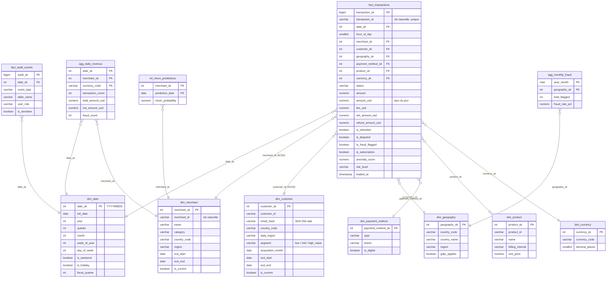

# 03 — Modèle OLAP : star schema (Amazon Redshift)

> Livrable 3 : *Schema Design for OLAP System* — star schema, stratégie de jointures et sous-requêtes, time-series, pré-agrégations / vues matérialisées / tables de synthèse.

- Code dbdiagram.io : [`schemas/olap_dbdiagram.txt`](../schemas/olap_dbdiagram.txt)
- DDL exécutable (PostgreSQL local, annoté Redshift) : [`sql/ddl_olap.sql`](../sql/ddl_olap.sql)
- Construction depuis l'OLTP (simulation dbt) : [`build_olap.py`](../build_olap.py)

---

## 1. Diagramme



**2 tables de faits, 7 dimensions, 2 tables d'agrégation, 1 vue matérialisée, 1 table de sortie ML.**

**Grain de `fact_transactions` : une ligne = une transaction OLTP.** C'est le grain le plus fin possible ; tout agrégat en dérive et rien n'est jamais saisi directement dans l'OLAP.

---

## 2. Star plutôt que snowflake

| | Star (retenu) | Snowflake |
|---|---|---|
| Jointures par requête | 1 par dimension | 2-3 par dimension (dim_merchant → dim_category → dim_sector…) |
| Lisibilité pour les analystes / BI | Élevée | Faible |
| Redondance | Acceptée (`region` répété dans `dim_geography`) — quelques Ko | Minimale |
| Performance Redshift | Optimale : dimensions `DISTSTYLE ALL`, une seule passe | Chaque niveau supplémentaire = un shuffle potentiel |

Les dimensions sont petites (< 1 M lignes même à l'échelle Stripe) : la redondance coûte rien, la simplicité rapporte tout.

---

## 3. Surrogate keys et SCD Type 2

Chaque dimension a une clé de substitution entière (`merchant_sk`) distincte de la clé naturelle OLTP (`merchant_id`) :

- jointures sur entiers (plus rapides, plus compacts qu'un `varchar`) ;
- stabilité : un changement d'ID côté OLTP ne casse pas l'historique ;
- **prérequis du SCD Type 2** : plusieurs versions d'un même merchant coexistent, chacune avec sa propre SK.

### Fonctionnement

`dim_merchant` et `dim_customer` conservent l'historique des attributs (`scd_start`, `scd_end`, `is_current`). Quand un merchant change de catégorie, dbt (`snapshot`, stratégie `check`) ferme la version courante et en insère une nouvelle. **La fact table pointe sur la SK valide au moment de la transaction**, jamais sur la clé naturelle.

```sql
-- Vue historique (« telle qu'elle était ») : la SK stockée dans la fact suffit
SELECT hist.category, SUM(f.amount_usd)
FROM fact_transactions f
JOIN dim_merchant hist ON hist.merchant_sk = f.merchant_sk
GROUP BY hist.category;

-- Vue actuelle (« as-is ») : on repasse par la clé naturelle et is_current
SELECT curr.category, SUM(f.amount_usd)
FROM fact_transactions f
JOIN dim_merchant hist ON hist.merchant_sk = f.merchant_sk
JOIN dim_merchant curr ON curr.merchant_id = hist.merchant_id AND curr.is_current = true
GROUP BY curr.category;
```

Le jeu de démo contient 3 merchants ayant changé de catégorie il y a 6 mois : la requête **OLAP Q9** montre les deux lectures diverger (voir [08_queries.md](08_queries.md)).

### Segment client

`dim_customer.segment` (`low_value` / `mid_value` / `high_value`) est **calculé par dbt** chaque nuit : déciles de dépense USD sur 12 mois glissants (1-4 → low, 5-8 → mid, 9-10 → high). Un changement de segment ouvre une nouvelle version SCD2 — on peut donc mesurer les migrations de segment dans le temps.

---

## 4. Mesures de la fact table

| Mesure | Calcul (dbt, couche `intermediate`) | Usage |
|---|---|---|
| `amount` | montant d'origine | audit, rapprochement OLTP |
| `amount_usd` | `amount × exchange_rates.rate_to_usd` **au jour de la transaction** | comparaisons multi-devises fidèles à l'historique |
| `fee_usd` | 2,9 % + 0,30 $ sur les succès | revenu Stripe (≠ volume traité) |
| `refund_amount_usd` | somme des refunds `succeeded` | taux de remboursement |
| `net_amount_usd` | `amount_usd − fee_usd − refund_amount_usd` | revenu net merchant |
| `is_fraud_flagged` | `risk_level ∈ {high, critical}` | taux de fraude modèle |
| `is_disputed` | existence d'un dispute | taux de chargeback (vérité terrain) |
| `is_subscription` | `subscription_id IS NOT NULL` | part du récurrent |
| `status` | `succeeded` / `failed` | taux d'échec (une fact sans statut ne peut pas le calculer) |

Les booléens sont sommés via `SUM(CASE WHEN … THEN 1 ELSE 0 END)` — portable Redshift/PostgreSQL (Redshift refuse `boolean::int`).

---

## 5. Stratégie pour les jointures massives, sous-requêtes et time-series

### Distribution et tri (Redshift)

| Table | `DISTSTYLE` / `DISTKEY` | `SORTKEY` | Effet |
|---|---|---|---|
| `fact_transactions` | `DISTKEY (merchant_sk)` | `date_sk` | Toutes les lignes d'un merchant sur le même nœud ; les zone maps sautent les blocs hors période |
| `agg_daily_revenue` | `DISTKEY (merchant_sk)` | `date_sk` | Co-localisée avec la fact → jointure fact ↔ agg sans réseau |
| `dim_*` | `DISTSTYLE ALL` | clé | Copie complète sur chaque nœud : **aucun shuffle** pour joindre la fact aux dimensions |
| `fact_audit_events` | `EVEN` | `date_sk` | Pas de jointure lourde, répartition uniforme |
| `agg_monthly_fraud` | `ALL` | `year_month` | Minuscule, lue partout |

Règle : **la clé de distribution de la fact = la dimension la plus jointe et la plus filtrée** (merchant). Une jointure fact ↔ dim_customer se fait quand même localement grâce à `DISTSTYLE ALL`.

### Sous-requêtes et CTE

- Préférer les **CTE + window functions** aux sous-requêtes corrélées (une sous-requête corrélée s'exécute N fois ; une window function en une passe). Exemples : cumul annuel (Q1, `SUM(SUM()) OVER`), déciles (Q2, `NTILE`), variation trimestrielle (Q3, `LAG`), cohortes (Q5, `FIRST_VALUE`).
- Les sous-requêtes non corrélées sont matérialisées une fois par le planificateur — acceptables.
- **Filtrer avant de joindre** : un `WHERE date_sk BETWEEN …` sur la fact réduit le volume avant les jointures ; `ANALYZE` régulier pour des statistiques à jour.
- `EXPLAIN` systématique en revue de code (OLAP Q10 compare le plan sur `agg_daily_revenue` vs sur la fact).

### Time-series

- `dim_date` porte la hiérarchie (année → trimestre → mois → semaine → jour), les week-ends, jours fériés et l'exercice fiscal : toute analyse temporelle est une jointure + `GROUP BY`, sans fonction de date coûteuse.
- `hour_of_day` dans la fact pour l'intra-journalier (pics de fraude nocturnes).
- Moyennes mobiles et variations : `AVG() OVER (ROWS BETWEEN 6 PRECEDING AND CURRENT ROW)`, `LAG(x, 7)` (OLAP Q6), `LAG` sur 4 trimestres pour le YoY.
- Les séries longues (revenue quotidien sur 3 ans) se lisent sur `agg_daily_revenue`, jamais sur la fact.

---

## 6. Pré-agrégations : trois niveaux

| Niveau | Objet | Rafraîchissement | Quand l'utiliser |
|---|---|---|---|
| **1. Tables de synthèse dbt** (`agg_daily_revenue`, `agg_monthly_fraud`) | Tables physiques, grain jour × merchant × devise / mois × pays | dbt incrémental (DAG 02:00) — seules les partitions J-1/J-2 sont recalculées | Dashboards quotidiens, séries longues, exports ; grain et colonnes stables |
| **2. Vues matérialisées Redshift** (`mv_monthly_revenue_by_country`) | `CREATE MATERIALIZED VIEW … AUTO REFRESH YES` | Incrémental automatique par Redshift après chaque chargement | Agrégats fréquents dont la définition change souvent ; Redshift peut même **réécrire automatiquement** une requête sur la fact pour lire la MV |
| **3. Result cache** | Cache du résultat exact d'une requête | Invalidé au premier changement de données | Dashboards BI ré-exécutant la même requête |

`agg_daily_revenue` est clé sur `(date_sk, merchant_sk, currency_code)` : un merchant qui encaisse en deux devises a deux lignes par jour ; sans la devise dans la clé, la table violerait sa PK.

---

## 7. Couverture des champs analytiques de l'énoncé

| Énoncé | Où |
|---|---|
| Revenue metrics (daily, weekly, monthly) | `agg_daily_revenue` + `dim_date` (semaine, mois) ; MV mensuelle |
| Customer segmentation data | `dim_customer.segment` (SCD2) + déciles (Q2) |
| Product performance metrics | `dim_product` + `product_sk` sur la fact (Q7) |
| Fraud analysis data | `is_fraud_flagged`, `anomaly_score`, `risk_level`, `is_disputed`, `agg_monthly_fraud` (Q3) |
| Compliance and audit logs | `fact_audit_events` (Q8) |

---

## 8. Chargement (résumé — détail dans [05_pipeline.md](05_pipeline.md))

```
Kafka (CDC) → S3 (Kafka Connect sink, fichiers Avro 1 min) → COPY Redshift staging (raw_*)
   → dbt staging (cast, dédoublonnage par transaction_id + lsn)
   → dbt intermediate (amount_usd, fees, refunds, disputes, fraude)
   → dbt marts (fact_transactions en MERGE idempotent, snapshots SCD2, agg_*)
   → dbt test (not_null, unique, accepted_values, relationships) — bloquant
```

Le script `build_olap.py` reproduit exactement cette chaîne en pandas sur les CSV : c'est ce qui alimente la démo locale.
