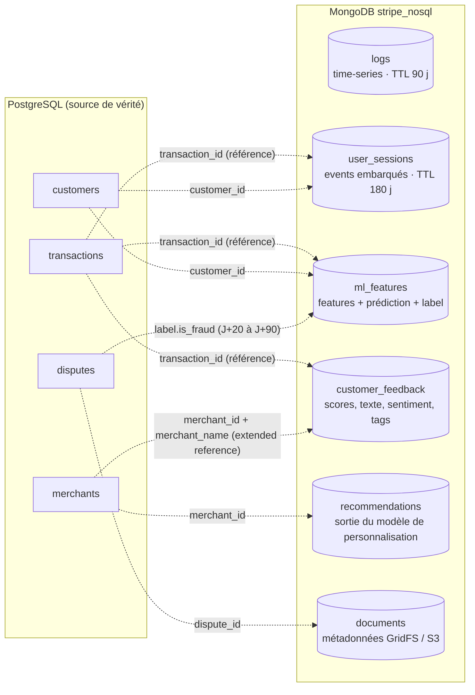
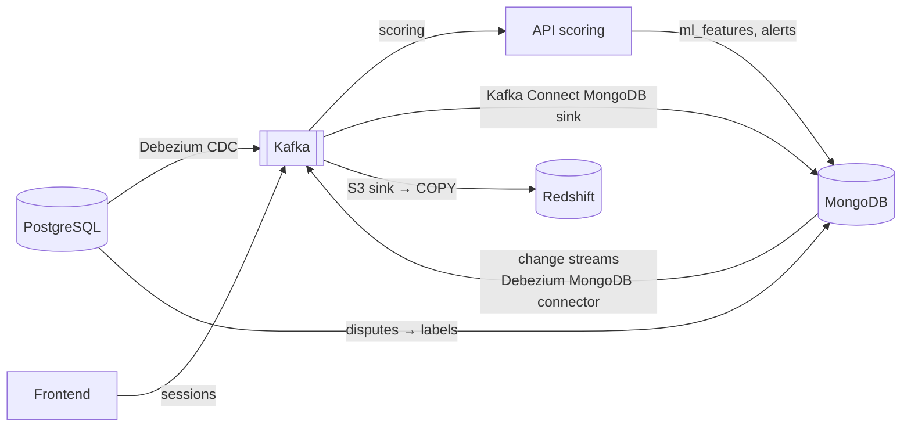

# 04 — Modèle NoSQL (MongoDB 7)

> Livrable 4 : *NoSQL Data Model* — données non structurées et semi-structurées, relations (embedding / referencing / indexation), intégration OLTP et OLAP.

- Schéma détaillé (exemples, validators, index, shard keys) : [`schemas/nosql_schema.json`](../schemas/nosql_schema.json)
- Script d'initialisation exécutable : [`scripts/mongo_init.js`](../scripts/mongo_init.js)
- Données : [`data/mongo/*.json`](../data/mongo/) (Extended JSON, `{"$date": …}`)

---

## 1. Collections



| Collection | Contenu | Volume | Rétention | Shard key |
|---|---|---|---|---|
| `logs` | Erreurs, accès, audit applicatif — **time-series collection** | Très élevé (milliards/mois) | 90 j (TTL natif) ; les `audit` sont archivés sur S3 Object Lock avant | `{meta.service, timestamp}` |
| `user_sessions` | 1 document = 1 session, events clickstream embarqués | Élevé | 180 j (index TTL) | `customer_id` hashed |
| `ml_features` | 1 document par transaction : features, prédiction, explications SHAP, **label retardé** | 1 : 1 avec les transactions | Illimitée, **anonymisée** après 24 mois | `transaction_id` hashed |
| `customer_feedback` | Avis, enquêtes, sentiment NLP, tags | Modéré | 36 mois puis anonymisation | `merchant_id` hashed |
| `recommendations` | Recommandations par merchant / segment / mois | Faible | 12 mois | `merchant_id` hashed |
| `documents` | Métadonnées des fichiers binaires (preuves de disputes) | Faible | Litige + 13 mois | — |

---

## 2. Pourquoi MongoDB pour ces données

| Caractéristique | Illustration | Ce que PostgreSQL ferait moins bien |
|---|---|---|
| **Schéma évolutif** | `ml_features.features` gagne un champ à chaque version de modèle | Migration `ALTER TABLE` ou colonne `jsonb` sans validation |
| **Documents imbriqués** | `user_sessions.events[]` de longueur variable, lus toujours avec la session | Table `session_events` + jointure + `GROUP BY` |
| **Écriture massive** | Logs et sessions en continu, `w:1` acceptable | Le WAL et les index ralentissent l'ingestion pure |
| **Time-series natif** | Compression colonne par `meta`, TTL, bucketing automatique | Extension TimescaleDB (possible mais hors périmètre) |
| **Requêtes ad hoc sur l'imbriqué** | `{"prediction.risk_level": "critical"}`, `$filter` sur un tableau | Opérateurs `jsonb` moins lisibles, index GIN génériques |
| **Sharding intégré** | Clé hashée, rééquilibrage automatique | Citus / partitionnement manuel |

Ce que MongoDB **ne remplace pas** : la source de vérité financière (ACID multi-tables, contraintes, comptabilité) reste PostgreSQL. La règle : *les faits d'argent en SQL, le contexte autour en documents.*

---

## 3. Relations : embedding, referencing, extended reference

### Embedding — « ce qui est lu ensemble vit ensemble »

| Embarqué | Pourquoi | Borne |
|---|---|---|
| `user_sessions.events[]` | Toujours lus avec la session, jamais seuls | `maxItems: 500` dans le validator ; au-delà → **bucket pattern** (un document par session *et* par tranche de 200 events) pour rester sous 16 Mo et garder des documents compacts |
| `ml_features.features`, `.prediction`, `.label` | Indissociables : un scoring = un document | Taille fixe (~1 Ko) |
| `logs.metadata`, `.trace` | Contexte technique lu avec le log | Taille fixe |
| `customer_feedback.scores`, `.sentiment`, `.tags[]` | Lus ensemble ; `tags` indexé multikey | < 20 tags |

### Referencing — « la vérité est ailleurs »

`transaction_id`, `customer_id`, `merchant_id` sont des **références vers PostgreSQL**. On ne duplique pas les attributs qui changent (statut de la transaction, email du client). La jointure vers l'OLTP se fait :
- côté application (lecture Mongo → lookup PostgreSQL par ID, avec cache Redis), ou
- côté pipeline (Kafka → Redshift, où `fact_sessions` rejoint `fact_transactions`).

Jamais un `$lookup` cross-système : MongoDB ne connaît pas PostgreSQL.

### Extended reference — « on copie ce qui ne bouge pas »

`customer_feedback` porte `country_code` et `merchant_name` copiés de l'OLTP : ces attributs sont stables et la requête « feedbacks négatifs par pays » (NoSQL Q4) serait impossible sans eux. Coût : une écriture de plus à l'ingestion ; bénéfice : zéro jointure à la lecture. Si le nom d'un merchant change, un job de réconciliation nocturne (`updateMany`) réaligne les copies.

### `$lookup` intra-Mongo

Utilisé entre collections MongoDB quand c'est pertinent (NoSQL Q8 : `recommendations` enrichies du NPS moyen de `customer_feedback`).

---

## 4. Indexation

Règle **ESR** (Equality, Sort, Range) pour les index composés : les champs d'égalité d'abord, puis le tri, puis les plages.

| Collection | Index | Requête servie |
|---|---|---|
| `logs` | `{meta.service, timestamp}` (automatique time-series), `{meta.severity, timestamp}` | Q1 (severity = égalité, timestamp = plage), Q5 |
| `user_sessions` | `{converted: 1, event_count: -1}` | Q2 : `converted = false` puis tri par `event_count` |
| `user_sessions` | `{session_start: 1}` **TTL** `expireAfterSeconds: 15552000` | Expiration automatique à 180 j |
| `user_sessions` | `{transaction_id: 1}` **sparse** | Seules les sessions converties ont ce champ : l'index ignore les autres |
| `ml_features` | `{transaction_id: 1}` **unique** | Un scoring par transaction ; upsert idempotent |
| `ml_features` | `{prediction.risk_level: 1, computed_at: -1}` | Q3 ; `explain()` (Q10) montre `IXSCAN`, 2 clés examinées pour 2 documents |
| `ml_features` | `{label.is_fraud: 1, computed_at: -1}` | Extraction du dataset d'entraînement mature |
| `customer_feedback` | `{tags: 1}` **multikey**, `{text: "text"}` | Tags fréquents, recherche plein texte |

Le TTL est un **index** dont le champ doit être un **BSON Date** — d'où les données générées en Extended JSON (`{"$date": …}`) : une chaîne ISO n'expirerait jamais. C'est le piège classique corrigé dans cette version.

---

## 5. Validation de schéma

« Flexible » ne veut pas dire « sans contrat ». Chaque collection a un validator `$jsonSchema` (`validationLevel: moderate` : les documents existants non conformes ne bloquent pas, les nouveaux doivent l'être) :

```javascript
// ml_features : la prédiction est obligatoire, bornée, avec un niveau de risque énuméré
prediction: {
  required: ["fraud_probability", "risk_level", "model_version"],
  properties: {
    fraud_probability: { bsonType: "double", minimum: 0, maximum: 1 },
    risk_level: { enum: ["low", "medium", "high", "critical"] }
  }
}
```

Le validator protège l'aval (dbt, entraînement ML) sans figer les champs libres (`features.*` peut évoluer).

---

## 6. Données XML et binaires

| Type | Traitement | Stockage |
|---|---|---|
| **JSON** (webhooks, events, features) | Natif BSON | Collections ci-dessus |
| **XML** (messages bancaires ISO 20022, webhooks partenaires) | Converti en BSON à l'ingestion (`xmltodict`) pour être requêtable ; **l'original est conservé** pour la preuve d'audit | Document converti dans la collection métier + original dans GridFS |
| **Binaire** (PDF de preuves de litige, captures, exports) | Métadonnées dans `documents` (type, taille, SHA-256, lien) | **GridFS** (bucket `evidence`, chunks de 255 Ko) pour < 16 Mo ; **S3** + `s3_key` au-delà ou pour l'archivage long |

---

## 7. Distribution, cohérence, transactions

### Topologie

- **Replica set** 3 nœuds (1 primaire, 2 secondaires) répartis sur 3 AZ ; élection automatique en < 10 s.
- **Sharding** au-delà de ~2 To ou 10 k écritures/s : `mongos` + config servers, clé **hashée** pour répartir uniformément (`customer_id`, `transaction_id`, `merchant_id`), clé composée `{meta.service, timestamp}` pour les logs (les requêtes filtrent par service et plage de temps).
- **Zone sharding** par région (`EU` / `US` / `APAC`) : les documents des clients européens restent sur des shards hébergés en UE → résidence des données ([06](06_security_compliance.md)).

### Cohérence

| Donnée | `writeConcern` | `readPreference` | Justification |
|---|---|---|---|
| `ml_features`, `customer_feedback` | `majority` | `primaryPreferred` | Une prédiction ne doit pas disparaître après une élection |
| `logs`, `user_sessions` | `w: 1` | `secondaryPreferred` | Débit prioritaire ; perdre 1 s de logs en cas de failover est acceptable |
| Analytique lourde | — | `secondary` | Ne pas concurrencer le scoring sur le primaire |

### Transactions multi-documents

Disponibles depuis MongoDB 4.0 sur replica set. Utilisées **avec parcimonie**, là où deux écritures doivent être atomiques : le scoring écrit `ml_features` **et** `fraud_alerts` dans une `session.withTransaction()` (NoSQL Q9). Évitées sur les logs (coût inutile) — la règle reste : *modéliser pour que l'unité d'écriture soit un seul document*.

### Résolution de conflits

- `ml_features` : `upsert` sur `transaction_id` unique ; si deux scorings arrivent (rejeu Kafka), le plus récent (`predicted_at`) gagne — *last-writer-wins* borné par l'idempotence.
- Copies dénormalisées (`merchant_name`) : réconciliation nocturne depuis l'OLTP, source de vérité.
- Le détail du modèle de cohérence inter-systèmes est dans [05_pipeline.md](05_pipeline.md).

---

## 8. Intégration avec l'OLTP et l'OLAP



| Sens | Mécanisme | Ce qui circule |
|---|---|---|
| OLTP → Mongo | Kafka (CDC) consommé par le service de scoring | `transaction_id` et contexte → `ml_features` ; `disputes` → `label` |
| Mongo → OLAP | **Change streams** publiés vers Kafka (connecteur Debezium MongoDB), sink S3, dbt | `fact_sessions` (conversion, device), `fact_feedback` (NPS), prédictions → `agg_monthly_fraud` |
| Mongo → OLTP | Écriture directe par le service de scoring (même transaction applicative) | `fraud_indicators` |
| OLAP → Mongo | DAG Airflow nocturne | `recommendations` (sortie du modèle de personnalisation entraîné sur Redshift) |

La **vue holistique** demandée par l'énoncé se construit dans Redshift : `fact_transactions` (argent) ⨝ `fact_sessions` (comportement) ⨝ prédictions (risque) sur `transaction_id`.

---

## 9. Politique de rétention et RGPD

| Collection | Durée | Puis | Base légale |
|---|---|---|---|
| `logs` | 90 j (TTL) | suppression ; `audit` copiés sur S3 Object Lock 12 mois (PCI-DSS Req 10.5) | intérêt légitime / obligation |
| `user_sessions` | 180 j (TTL) | suppression | intérêt légitime (analyse comportementale) |
| `ml_features` | 24 mois avec `customer_id` | **anonymisation** (`customer_id` retiré, features conservées) — jamais supprimées : nécessaires au réentraînement | intérêt légitime (lutte contre la fraude, PSD2) |
| `customer_feedback` | 36 mois | anonymisation | consentement |
| Droit à l'oubli | < 72 h | `deleteMany` sur `user_sessions`, `customer_feedback` ; `$unset customer_id` sur `ml_features` | RGPD art. 17 |
