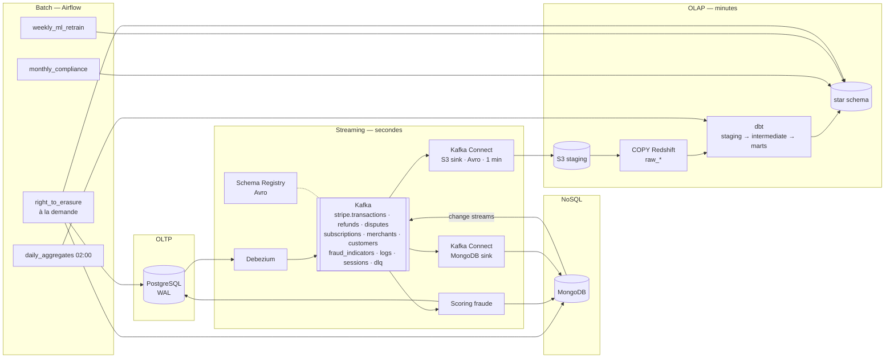

# 05 — Architecture du pipeline de données

> Livrable 5 : *Data Pipeline Architecture* — flux cohérent et temps réel entre OLTP, OLAP et NoSQL, composants batch et streaming, outils d'orchestration.

Code associé :
- Connecteur CDC : [`pipeline/kafka/debezium-postgres-connector.json`](../pipeline/kafka/debezium-postgres-connector.json)
- Transformations : [`pipeline/dbt/`](../pipeline/dbt/) (staging → intermediate → marts, snapshot SCD2, tests)
- Orchestration : [`pipeline/dags/daily_aggregates.py`](../pipeline/dags/daily_aggregates.py), [`pipeline/dags/right_to_erasure.py`](../pipeline/dags/right_to_erasure.py)
- Simulation locale de la chaîne dbt : [`build_olap.py`](../build_olap.py)

---

## 1. Deux modes, un bus



| Mode | Latence | Outils | Sert à |
|---|---|---|---|
| **Streaming** | < 1 s (Kafka), < 5 min (star schema) | Debezium, Kafka + Schema Registry, Kafka Connect, scoring, dbt micro-batch | Scoring temps réel, synchronisation OLTP → Mongo / OLAP, logs |
| **Batch** | Quotidien / hebdo / mensuel / à la demande | Airflow + dbt | Agrégats, SCD2, segments, taux de change, réentraînement ML, conformité, effacement RGPD |

Le streaming apporte la fraîcheur ; le batch apporte les calculs coûteux et la gouvernance. Les deux passent par **les mêmes modèles dbt** : une seule définition de `amount_usd`, de `is_fraud_flagged`, etc.

---

## 2. Composants

### 2.1 Debezium — Change Data Capture

Lit le **WAL** PostgreSQL (`wal_level = logical`, plugin `pgoutput`, un slot de réplication dédié) et publie chaque `INSERT` / `UPDATE` / `DELETE` sous forme d'événement `{before, after, op, source.lsn, ts_ms}`.

| Vs batch `SELECT … WHERE updated_at > …` | CDC |
|---|---|
| Charge sur les tables, index `updated_at` obligatoire | Lecture du WAL, zéro requête métier |
| Manque les `DELETE` | Capte tout, avec tombstones |
| Minutes | < 500 ms |
| Ordre approximatif | Ordre exact du LSN |

Détails du connecteur (fichier JSON) : snapshot initial, `column.exclude.list` pour **ne jamais publier `email` ni `ip_address`** dans Kafka (minimisation RGPD dès la source), routage `stripe.<table>`, DLQ, heartbeat pour surveiller le lag.

### 2.2 Kafka — bus d'événements

| Topic | Producteur | Clé de partition | Partitions | Rétention | Consommateurs |
|---|---|---|---|---|---|
| `stripe.transactions` | Debezium | `merchant_id` | 48 | 7 j | scoring, S3 sink |
| `stripe.refunds`, `stripe.disputes`, `stripe.subscriptions` | Debezium | `merchant_id` | 12 | 7 j | S3 sink, labels ML |
| `stripe.merchants`, `stripe.customers` | Debezium | id | 6 | compactés | S3 sink (dimensions) |
| `stripe.fraud_indicators` | Scoring | `merchant_id` | 12 | 3 j | S3 sink, alerting |
| `stripe.fraud_alerts` | Scoring | `merchant_id` | 6 | 3 j | PagerDuty, ops |
| `stripe.logs`, `stripe.sessions` | Services, frontend | `service` / `customer_id` | 48 | 1 j | MongoDB sink |
| `stripe.mongo.*` | Change streams | `_id` | 12 | 3 j | S3 sink |
| `stripe.dlq` | Tous | — | 3 | 30 j | Runbook de rejeu |

- **Clé = `merchant_id`** : tous les événements d'un merchant sont ordonnés dans une même partition (un refund ne dépasse jamais sa transaction). Le scoring par client reste possible car les features de vélocité sont lues dans Redis, pas déduites de l'ordre Kafka.
- **Schema Registry** (Avro, compatibilité `BACKWARD`) : une colonne ajoutée dans l'OLTP ne casse aucun consommateur ; une colonne supprimée est refusée à la publication.
- **Pourquoi Kafka** et pas SQS/RabbitMQ : rejeu depuis un offset, plusieurs groupes de consommateurs sur le même flux, débit de millions de messages/s, rétention = tampon en cas de panne aval.

### 2.3 Kafka Connect — sinks

| Sink | Cible | Réglages |
|---|---|---|
| **S3 sink** | `s3://stripe-data/raw/<topic>/dt=YYYY-MM-DD/hh=HH/` en Avro, flush toutes les 60 s ou 10 000 messages | Partitionné par heure → `COPY` Redshift incrémental |
| **MongoDB sink** | `logs`, `user_sessions` | `writemodel.strategy = ReplaceOneBusinessKey` (idempotent sur `_id`), `w:1` |
| **Debezium MongoDB source** | change streams `ml_features`, `customer_feedback`, `user_sessions` → Kafka | Alimente Redshift (`fact_sessions`, `fact_feedback`) |

### 2.4 dbt — transformation et qualité

```
raw_transactions (COPY Redshift)
   │  stg_transactions      cast, dédoublonnage (row_number() over transaction_id order by lsn desc), filtre op <> 'd'
   ▼
int_transactions_enriched  amount_usd (taux du jour), fee_usd, refunds, disputes, fraude
   ▼
fact_transactions          MERGE sur transaction_id, résolution des SK à la date de la transaction
dim_merchant / dim_customer  snapshots SCD2 (strategy = check)
agg_daily_revenue, agg_monthly_fraud  incrémental (J-2 → J)
   ▼
dbt test                   not_null, unique, accepted_values, relationships, accepted_range, recency, contrôle PII
```

- **Micro-batch toutes les 5 minutes** (`dbt run --select marts+`, modèles incrémentaux) déclenché par Airflow : le star schema est à jour à 5 min près, sans coût d'une transformation continue.
- **Enrichissement** : conversion de devise au taux du jour de la transaction (pas du jour de chargement), fees Stripe, géo-IP (déjà faite à l'ingestion OLTP via MaxMind), catégorisation MCC, jointure produits.
- Les tests sont **bloquants** dans le DAG : un test rouge arrête la chaîne avant `REFRESH MATERIALIZED VIEW` — les dashboards affichent des données d'hier plutôt que des données fausses.
- `dbt docs` génère le **lineage** colonne par colonne (exigence RGPD « d'où vient cette donnée ? ») ; exporté vers OpenLineage / DataHub.

### 2.5 Airflow — orchestration

| DAG | Planification | Étapes | SLA |
|---|---|---|---|
| `daily_aggregates` | 02:00 UTC | taux de change BCE → `dbt snapshot` (SCD2) → `dbt run marts` → `dbt test` → `REFRESH MV` → segments clients | terminé avant 04:00 |
| `streaming_marts` | toutes les 5 min | `dbt run --select fact_transactions` incrémental + tests critiques | < 5 min |
| `weekly_ml_retrain` | lundi 03:00 | dataset mature (labels > 90 j) → entraînement → évaluation → MLflow staging | — |
| `monthly_compliance` | J+1 06:00 | rapports PCI-DSS / RGPD (Q8 OLAP) → PDF → S3 Object Lock → Legal | — |
| `right_to_erasure` | à la demande (API) | OLTP → MongoDB → Redshift → audit | < 72 h |

Conventions : `retries = 3` avec backoff exponentiel, `max_active_runs = 1` (pas de chevauchement), callback Slack sur échec, `sla` par tâche, `catchup = False`.

---

## 3. Cohérence des données et résolution des conflits

### 3.1 Modèle de cohérence

| Système | Modèle | Ce que ça implique |
|---|---|---|
| **PostgreSQL** | Cohérence forte — **source de vérité** | Toute question « combien a-t-on réellement encaissé ? » se répond ici |
| **MongoDB** | À terme (secondes) | Une prédiction peut exister quelques centaines de ms avant que la transaction soit visible dans Redshift — acceptable |
| **Redshift** | À terme (< 5 min) | Les dashboards affichent « données à jour à HH:MM » ; jamais utilisés pour une décision transactionnelle |

Règle d'or : **les dérivés ne réécrivent jamais la source**. MongoDB et Redshift ne produisent aucune donnée qui remonte vers l'OLTP, sauf via un service (scoring → `fraud_indicators`) qui passe par l'API et donc par les contraintes de l'OLTP.

### 3.2 Garanties de livraison

Kafka est *at-least-once* : un message peut être livré deux fois (rebalance, retry). Le pipeline devient **exactly-once effectif** par **idempotence à chaque étape** :

| Étape | Mécanisme d'idempotence |
|---|---|
| Debezium → Kafka | Producteur idempotent (`enable.idempotence = true`), offsets commités après écriture |
| Kafka → scoring | `upsert` sur `ml_features.transaction_id` (index unique) ; `INSERT … ON CONFLICT DO NOTHING` sur `fraud_indicators` |
| Kafka → MongoDB | `ReplaceOneBusinessKey` sur `_id` |
| Kafka → S3 → Redshift | Fichiers nommés par offset (`topic+partition+startOffset`) ; `COPY` avec manifeste → un fichier n'est chargé qu'une fois |
| dbt | `stg_*` dédoublonne par `(transaction_id, lsn)` ; `fact_*` en `MERGE` sur la clé naturelle |

### 3.3 Résolution des conflits

| Situation | Règle | Implémentation |
|---|---|---|
| Deux versions du même enregistrement (UPDATE puis rejeu) | **Le LSN le plus élevé gagne** (last-writer-wins ordonné par la source, pas par l'heure de réception) | `qualify row_number() over (partition by transaction_id order by lsn desc) = 1` |
| Événement en retard (*late-arriving*) : un refund arrive avant sa transaction | Attendre : le refund est retenu en staging jusqu'à ce que la transaction existe (`relationships` test) ; rejoué au run suivant | Table `stg_orphans`, alerte si > 1 h |
| Deux scorings pour une même transaction (rejeu) | `predicted_at` le plus récent gagne | `upsert` avec `$max` sur `predicted_at` |
| Copie dénormalisée obsolète (`merchant_name` dans `customer_feedback`) | La source de vérité écrase la copie | Job de réconciliation nocturne |
| Changement d'attribut de dimension | Jamais d'écrasement : nouvelle version SCD2 | dbt snapshot |
| Effacement RGPD vs faits financiers | Les faits restent, l'identité part | `right_to_erasure` |
| Événement non parsable | Ne bloque jamais le flux | **DLQ** `stripe.dlq` + alerte + runbook |

### 3.4 Panne et reprise

| Scénario | Comportement | RPO / RTO |
|---|---|---|
| Consommateur (scoring, sink) en panne | Reprend à son dernier offset ; aucune perte tant que la rétention (7 j) n'est pas dépassée | 0 / minutes |
| PostgreSQL bascule sur le standby | Slot de réplication synchronisé (PG16) → Debezium reprend au bon LSN | 0 / < 1 min |
| Redshift indisponible | Les fichiers s'accumulent sur S3 ; `COPY` rattrape au retour | 0 / rattrapage automatique |
| Message empoisonné | DLQ, le reste du flux continue | — |
| **Backfill** (nouveau modèle dbt, bug corrigé) | `dbt run --full-refresh --select model` depuis S3 (rétention illimitée) ou re-snapshot Debezium (`snapshot.mode = always`) sur un topic dédié | runbook documenté, testé trimestriellement |
| Perte de Kafka (3 AZ) | Les producteurs bufferisent ; l'OLTP continue de fonctionner (le CDC est asynchrone) | 0 sur l'OLTP |

---

## 4. Scalabilité et performance par système

| Système | Levier | Détail |
|---|---|---|
| PostgreSQL | Partitions mensuelles, index partiels, read replicas, PgBouncer ; Citus par `merchant_id` au-delà de 5 To | [02_oltp_erd.md](02_oltp_erd.md) §6-7 |
| Kafka | 48 partitions par topic chaud ; consumer groups scalés horizontalement (1 consommateur par partition max) ; compression `zstd` | Débit cible 50 k msg/s par topic |
| Scoring | Stateless derrière un load balancer, autoscaling sur le lag Kafka ; **Redis** pour les features online (< 1 ms) et cache des profils | Budget 200 ms détaillé dans [07_ml_integration.md](07_ml_integration.md) |
| Redshift | RA3 (stockage managé S3), `DISTKEY` / `SORTKEY`, `agg_*`, MV `AUTO REFRESH`, **concurrency scaling** pour les pics BI, result cache | [03_olap_schema.md](03_olap_schema.md) §5-6 |
| MongoDB | Sharding par clé hashée, time-series collections, TTL, `secondaryPreferred` pour l'analytique | [04_nosql_model.md](04_nosql_model.md) §7 |
| S3 | Partitionné par `dt=/hh=`, Parquet après compaction quotidienne, lifecycle → Glacier après 24 mois | Coût stockage ÷ 10 |

**Cache** : Redis sert (1) les features online du scoring, (2) les réponses de l'API de consultation merchant (TTL 30 s), (3) les taux de change du jour. Le result cache Redshift et les MV couvrent la BI. Aucune décision financière ne lit un cache.

---

## 5. Qualité, observabilité, exploitation

| Dimension | Outil | Signal | Seuil d'alerte |
|---|---|---|---|
| Qualité des données | dbt tests (+ `dbt-expectations`) | tests rouges, `store-failures` | 1 test critique rouge = DAG bloqué |
| Fraîcheur | `dbt source freshness`, `recency` | âge de la dernière ligne | > 15 min (fact), > 26 h (agg) |
| Lag CDC / Kafka | Burrow / MSK metrics | consumer lag par groupe | > 10 000 messages ou > 60 s |
| Volumétrie | dbt `volume anomalies` (Elementary) | écart vs J-7 | ± 30 % |
| Pipeline | Airflow SLA miss, Grafana | durée, échecs | SLA dépassé |
| Lineage | dbt docs → OpenLineage → DataHub | graphe colonne à colonne | — |
| Alerting | Slack `#data-alerts`, PagerDuty pour le scoring | | |

### Environnements et CI/CD

- `dev` (docker-compose de ce dépôt), `staging`, `prod` ; infrastructure en Terraform (MSK, Redshift, MWAA, Atlas).
- Chaque PR dbt exécute `dbt build` sur un schéma jetable (slim CI, `--defer`) ; merge sur `main` = déploiement.
- Les DAGs sont versionnés avec le projet et déployés par pipeline, jamais édités à la main.

---

## 6. Latences cibles récapitulées

| Flux | Cible | Mesure |
|---|---|---|
| Transaction → Kafka | < 500 ms | Debezium heartbeat vs `ts_ms` |
| Kafka → décision fraude | < 200 ms P95 | histogramme API scoring |
| Kafka → MongoDB | < 1 s | lag du sink |
| Kafka → star schema | < 5 min | `loaded_at` − `created_at` (test `recency`) |
| Agrégats quotidiens | prêts à 04:00 UTC | SLA Airflow |
| Droit à l'oubli | < 72 h | durée du DAG + audit |
