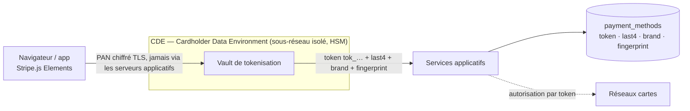

# 06 — Sécurité et conformité

> Livrable 6 : *Security and Compliance Plan* — chiffrement, contrôle d'accès, audit ; conformité RGPD, PCI-DSS, CCPA ; reporting et monitoring automatisés.

Implémentations exécutables dans ce dépôt : trigger d'immuabilité et vue pseudonymisée ([`sql/ddl_oltp.sql`](../sql/ddl_oltp.sql)), pseudonymisation à l'ETL ([`build_olap.py`](../build_olap.py)), exclusion des PII du CDC ([`pipeline/kafka/debezium-postgres-connector.json`](../pipeline/kafka/debezium-postgres-connector.json)), DAG d'effacement ([`pipeline/dags/right_to_erasure.py`](../pipeline/dags/right_to_erasure.py)), contrôle PII automatisé ([`pipeline/dbt/models/marts/schema.yml`](../pipeline/dbt/models/marts/schema.yml)), requêtes de reporting (OLTP Q8, OLAP Q8 dans [08_queries.md](08_queries.md)).

---

## 1. Réglementations et périmètre

| Réglementation | Périmètre | Obligations structurantes pour l'architecture |
|---|---|---|
| **PCI-DSS v4.0** | Toute donnée de carte (PAN, CVV, piste) | Ne jamais stocker le PAN hors vault, segmentation réseau (CDE), chiffrement fort, journaux 12 mois, tests d'intrusion |
| **RGPD** | Données personnelles des résidents UE (email, IP, comportement) | Base légale, minimisation, pseudonymisation, droits (accès, effacement, portabilité), notification 72 h, DPIA pour le scoring, registre des traitements, résidence / transferts |
| **CCPA / CPRA** | Résidents californiens | Droit d'accès et de suppression sous 45 j, opt-out « do not sell/share », inventaire des données |
| PSD2 (contexte) | Paiements UE | Authentification forte (3DS — `action_taken = challenge_3ds`), surveillance des transactions |

---

## 2. Classification des données

Toute règle (chiffrement, masquage, accès, rétention) découle de la classe.

| Classe | Exemples | Stockage | Accès |
|---|---|---|---|
| **Restreint (PCI)** | PAN, CVV, piste | **Vault tokenisé uniquement** (CDE) — absent de tous les schémas de ce projet | Service de tokenisation seul |
| **Confidentiel (PII)** | `customers.email`, `transactions.ip_address`, `geo_city`, `audit_logs.user_id`, `user_sessions.geo.ip_address` | OLTP chiffré colonne ; **jamais en clair** hors OLTP (hash / troncature) | `admin`, services ; analystes via vues |
| **Interne** | Montants, statuts, merchants, features ML, logs techniques | Chiffrement at-rest standard | Rôles métier |
| **Public** | `countries`, `currencies` | — | Tous |

Les colonnes PII sont **annotées dans l'ERD** (`[note: 'PII']`) et taguées dans le catalogue (DataHub) : le tag pilote le masquage dynamique et les tests dbt.

---

## 3. Chiffrement et gestion des clés

### At-rest

| Système | Mécanisme | Clé |
|---|---|---|
| PostgreSQL | Volumes chiffrés AES-256 (EBS/RDS) **+ `pgcrypto`** sur `customers.email` (chiffrement colonne : un accès SQL illégitime ne lit pas l'email) | CMK KMS `oltp-prod`, rotation annuelle automatique |
| Redshift | AES-256 natif, clé KMS dédiée ; **pas de PII en clair** de toute façon (hash / troncature à l'ETL) | CMK `olap-prod` |
| MongoDB | Encrypted storage engine AES-256 **+ Client-Side Field Level Encryption / Queryable Encryption** sur `user_sessions.geo.ip_address` et `customer_feedback.customer_id` (chiffré avant d'atteindre le serveur) | CMK `nosql-prod` via KMS provider |
| Kafka | Disques chiffrés ; les PII sont **exclues à la source** (`column.exclude.list`) | CMK `streaming-prod` |
| S3 (staging, archives, rapports) | SSE-KMS, **Object Lock** (WORM) sur `audit/` et `compliance/` | CMK `archive-prod` |
| Redis | Chiffrement at-rest + in-transit (ElastiCache), TTL court, aucune PII | — |

**Enveloppe** : les données sont chiffrées par des clés de données (DEK) elles-mêmes chiffrées par la CMK (KMS/HSM). Séparation des rôles : les administrateurs de clés (`key-admin`) ne sont pas les administrateurs de données. Le vault PCI utilise un **HSM** (CloudHSM) — exigence PCI-DSS Req 3.6.

### In-transit

- **TLS 1.3** partout (1.2 refusé), certificats ACM renouvelés automatiquement.
- **mTLS** entre Debezium, Kafka, Kafka Connect et les consommateurs ; ACL Kafka par principal (un consommateur ne lit que ses topics).
- MongoDB : authentification x.509 + TLS ; PostgreSQL : `sslmode = verify-full`.

---

## 4. Tokenisation PCI-DSS et segmentation réseau

- `payment_methods` stocke **`token`** (référence opaque), `last4`, `brand`, `exp_month/year` et **`fingerprint`** (hash irréversible de la carte, utile contre la fraude — OLTP Q6) : **aucun PAN, aucun CVV, nulle part**.
- Le **CDE** est un VPC séparé : subnets privés, security groups en liste blanche, pas d'accès Internet sortant sauf réseaux cartes, bastion avec MFA, journalisation de chaque flux (VPC Flow Logs) — PCI Req 1.
- Le reste de la plateforme est **hors périmètre PCI** : c'est tout l'intérêt de la tokenisation (réduction du scope d'audit).

---

## 5. Pseudonymisation et minimisation (RGPD)

| Donnée | OLTP | Kafka | Redshift | MongoDB |
|---|---|---|---|---|
| Email | chiffré colonne | **exclu** | `email_hash` = SHA-256(sel + email) — jointure possible, lecture impossible | absent |
| IP | `inet` complet (nécessaire à la fraude) | **exclu** | absent (le pays et la ville suffisent) | tronquée `/24` (`82.64.12.0`) |
| Identifiant client | `customer_id` | `customer_id` | `customer_sk` (entier opaque) + `customer_id` effaçable | `customer_id` effaçable / `$unset` |
| Géolocalisation | ville + pays | pays | pays | ville + pays |

- La vue `v_transactions_analyst` (DDL) expose `host(set_masklen(ip::cidr, 24))` — l'IP complète n'est lisible que par les rôles `admin` et `service`.
- **Pourquoi tronquer plutôt que hasher l'IP** : une IP est une donnée personnelle (CJUE, *Breyer*, 2016) ; la troncature `/24` garde l'information géographique utile à la fraude tout en rendant l'individu non identifiable. Un hash serait réversible par force brute (2³² valeurs).
- Redshift : **dynamic data masking** (`CREATE MASKING POLICY`) et **column-level GRANT** remplacent les vues manuelles pour les rôles analystes.

---

## 6. Contrôle d'accès

### Identité

SSO (Okta) + **MFA obligatoire** pour tout accès humain ; rôles IAM par service (jamais de clé longue durée) ; secrets dans **AWS Secrets Manager** avec rotation à 90 j (le connecteur Debezium lit `${secrets:…}`, aucun mot de passe dans le code).

### Rôles (RBAC) — principe du moindre privilège

| Rôle | OLTP (PostgreSQL) | OLAP (Redshift) | MongoDB | Kafka |
|---|---|---|---|---|
| `admin` (2 personnes, MFA, sessions enregistrées) | tous droits sauf `UPDATE/DELETE audit_logs` (trigger) | tous droits | `root` | superuser |
| `service_api` | `INSERT/UPDATE` tables métier, `INSERT audit_logs` | — | — | produce `stripe.logs` |
| `service_scoring` | `INSERT fraud_indicators` | — | `readWrite ml_features, fraud_alerts` | consume `transactions`, produce `fraud_*` |
| `debezium` | `REPLICATION` + `SELECT` sur les tables publiées (sans `email`, `ip`) | — | change streams | produce `stripe.*` |
| `data_engineer` | `SELECT` sur vues | `CREATE/INSERT` schémas `staging`, `marts` | `readWrite` collections techniques | admin topics |
| `analyst` | `SELECT v_transactions_analyst` uniquement | `SELECT marts` avec masquage dynamique | `read` sur `ml_features`, `customer_feedback` (CSFLE : champs chiffrés illisibles) | — |
| `compliance` | `SELECT audit_logs` | `SELECT fact_audit_events, agg_monthly_fraud` | `read logs (meta.type = audit)` | — |
| `readonly` (support) | `SELECT` vues exposées | — | — | — |

- Aucun compte applicatif n'a `DROP`, `TRUNCATE`, ni `DELETE` sur `transactions`.
- Les accès privilégiés passent par un **bastion** avec enregistrement de session ; les requêtes ad hoc en prod nécessitent un ticket.

---

## 7. Audit logging

Trois couches complémentaires, chacune avec un rôle précis :

| Couche | Ce qu'elle capte | Où | Immuabilité |
|---|---|---|---|
| **Applicative** — table `audit_logs` (OLTP) | Actions métier : exports, effacements RGPD, changements de rôle, accès aux moyens de paiement via l'API | PostgreSQL, puis `fact_audit_events` (Redshift) pour le reporting | Trigger `audit_logs_immutable` (aucun `UPDATE/DELETE`, même admin) + réplication S3 Object Lock |
| **Base de données** — `pgaudit`, audit Redshift (`stl_query`, `stl_connection_log`), audit MongoDB Atlas | Toute requête SQL/NoSQL directe, y compris les `SELECT` d'un admin en console | Logs → CloudWatch → SIEM | Object Lock 12 mois (PCI Req 10.5.1) |
| **Infrastructure** — CloudTrail, VPC Flow Logs, Kafka authorizer logs | Appels API cloud, flux réseau, accès aux topics | SIEM | Object Lock |

Le **SIEM** (Splunk / Wazuh / OpenSearch) corrèle les trois couches et alimente le monitoring ci-dessous. Rétention : 12 mois en ligne dont 3 mois immédiatement consultables (PCI Req 10.5).

---

## 8. Monitoring et détection

| Signal | Source | Seuil | Réponse |
|---|---|---|---|
| Échecs de connexion | `audit_logs`, pgaudit | > 5 en 1 min / IP | Blocage IP, alerte Slack sécurité |
| Export volumineux | `audit_logs` (`EXPORT`) | > 10 000 lignes ou > 3 exports / h / utilisateur | Alerte + revue manager |
| Accès hors horaires à `payment_methods` | pgaudit | 00h-06h, rôle humain | Notification + justification requise |
| `SELECT` direct sur une table PII par un rôle analyste | pgaudit | 1 occurrence | Incident (le rôle ne devrait pas pouvoir) |
| Tentative `UPDATE/DELETE audit_logs` | trigger + pgaudit | 1 occurrence | **Incident critique**, PagerDuty |
| Lag CDC ou DLQ non vide | Kafka metrics | > 60 s / > 0 | Alerte data-platform |
| PAN détecté dans un log ou un bucket | Amazon Macie / DLP regex Luhn | 1 occurrence | Incident PCI, purge, post-mortem |
| Dérive des accès (nouveau rôle, nouveau GRANT) | CloudTrail, `pg_roles` diff quotidien | tout changement | Revue hebdomadaire |

Outils : CloudWatch / Grafana (métriques), Datadog (APM + logs), SIEM (corrélation), PagerDuty (escalade), Macie (découverte de données sensibles).

---

## 9. Droits des personnes et procédures RGPD / CCPA

| Droit | Procédure | Délai interne (légal) |
|---|---|---|
| **Accès / portabilité** (art. 15, 20 ; CCPA) | DAG `subject_access_request` : export JSON depuis OLTP + MongoDB (sessions, feedback) + prédictions les concernant, livré via portail sécurisé | 7 j (30 j / 45 j) |
| **Effacement** (art. 17 ; CCPA) | DAG `right_to_erasure` : OLTP (email remplacé, IP/ville effacées, soft delete) → MongoDB (`deleteMany` sessions, `$unset customer_id` features/feedback) → Redshift (`dim_customer` anonymisée) → ligne `ERASURE` dans `audit_logs` | 72 h (30 j) |
| **Rectification** (art. 16) | API standard + CDC propage | immédiat |
| **Opposition / limitation** (art. 18, 21) | Flag `marketing_opt_out` ; exclusion des modèles de personnalisation | immédiat |
| **Décision automatisée** (art. 22) | Le blocage d'un paiement par le modèle est **explicable** (SHAP stocké dans `ml_features.prediction.top_shap`) et **contestable** (file de revue humaine) — voir [07_ml_integration.md](07_ml_integration.md) | — |
| **CCPA « Do not sell / share »** | Flag `ccpa_opt_out` ; aucune donnée transmise à des tiers hors sous-traitants | 15 j |

**Exception importante à l'effacement** : les transactions financières relèvent d'une **obligation légale de conservation** (comptabilité, lutte anti-blanchiment : 5 à 10 ans). Elles ne sont donc pas supprimées mais **détachées de l'identité** — c'est ce que fait le DAG. Un jury pose souvent la question.

### Violation de données (art. 33-34)

Runbook : détection (SIEM) → qualification en < 24 h par le DPO et le RSSI → **notification CNIL sous 72 h** → notification des personnes si risque élevé → post-mortem. Le registre des incidents est tenu dans l'outil de ticketing, exercice de simulation semestriel.

### Gouvernance

- **Registre des traitements** (art. 30) généré depuis le catalogue (DataHub) : chaque table / collection porte finalité, base légale, durée, destinataires.
- **DPIA** réalisée pour le scoring de fraude (décision automatisée à effet significatif) et le profilage comportemental.
- **Sous-traitants** : AWS (UE), MongoDB Atlas (UE), MaxMind — clauses contractuelles types, liste publiée.

---

## 10. Résidence des données et juridictions

| Mécanisme | Implémentation |
|---|---|
| `countries.data_region` (`EU` / `US` / `APAC`) porté par chaque client et merchant | Clé de routage des données |
| PostgreSQL | Une instance (ou un cluster Citus) **par région** ; l'API route par `data_region` |
| MongoDB | **Zone sharding** : les shards `EU` sont physiquement en `eu-west-1/3` ; un document `data_region = EU` ne peut pas migrer ailleurs |
| Redshift | Cluster `eu-west-1` pour les données UE ; les analyses globales lisent des **agrégats anonymes** répliqués (jamais des lignes PII) |
| Kafka | Clusters régionaux + réplication filtrée (MirrorMaker 2) des topics sans PII |
| Transferts hors UE | Uniquement des données pseudonymisées ou agrégées ; SCC signées avec les sous-traitants |

---

## 11. Rétention unifiée

| Donnée | Durée | Puis | Base |
|---|---|---|---|
| Transactions, refunds, disputes (OLTP + OLAP) | 10 ans | Archivage S3 Glacier (partitions détachées) | Obligation comptable / LCB-FT |
| `customers` (identité) | Durée de la relation + 3 ans | Anonymisation | Intérêt légitime |
| `payment_methods.token` | Jusqu'à suppression par le client ou expiration + 13 mois | Suppression (le vault révoque le token) | PCI, contestations |
| `audit_logs` et logs d'audit | 12 mois en ligne (3 mois immédiats) + 5 ans archivés | Object Lock | PCI Req 10.5, RGPD accountability |
| `logs` techniques (Mongo) | 90 j | TTL | Intérêt légitime |
| `user_sessions` | 180 j | TTL | Intérêt légitime |
| `ml_features` | 24 mois identifiées | Anonymisation, conservation illimitée | Lutte anti-fraude (PSD2) |
| `customer_feedback` | 36 mois | Anonymisation | Consentement |
| Rapports de conformité | 5 ans | Object Lock | PCI |

---

## 12. Mapping PCI-DSS v4.0 → mesures

| Exigence | Intitulé | Mesure dans l'architecture |
|---|---|---|
| 1 | Contrôles de sécurité réseau | CDE isolé (VPC, SG, pas d'Internet sortant), VPC Flow Logs |
| 2 | Configurations sécurisées | Images durcies (CIS), Terraform revu, pas de compte par défaut |
| 3 | Protection des données de compte stockées | Tokenisation, aucun PAN/CVV hors vault, HSM, `last4` seul affichable |
| 4 | Chiffrement en transit | TLS 1.3, mTLS Kafka, `verify-full` |
| 5 | Protection contre les logiciels malveillants | EDR sur les hôtes du CDE |
| 6 | Développement sécurisé | Revue de code, SAST/DAST en CI, dépendances scannées |
| 7 | Restriction d'accès selon le besoin | RBAC §6, moindre privilège, vues et masquage |
| 8 | Identification et authentification | SSO + MFA, rotation des secrets 90 j, pas de compte partagé |
| 9 | Accès physique | Datacenters AWS (rapport SOC 2 / PCI AOC) |
| 10 | Journalisation et surveillance | Trois couches d'audit §7, immuabilité, 12 mois, SIEM §8 |
| 11 | Tests de sécurité | Scans trimestriels ASV, pentest annuel, détection de changements |
| 12 | Politiques organisationnelles | Politique de sécurité, formation, gestion des sous-traitants, plan de réponse aux incidents |

---

## 13. Conformité automatisée : contrôles et rapports

L'énoncé demande des *automated compliance checks* : ils sont exécutés par le pipeline, et les rapports sont la **sortie des contrôles**, pas un document rédigé à la main.

### Contrôles continus

| Contrôle | Outil | Fréquence | Échec ⇒ |
|---|---|---|---|
| Aucune colonne PII en clair dans les marts (`email_hash` ne ressemble pas à un email, aucune colonne `email`/`ip_address` dans `marts`) | dbt tests (`schema.yml`) | à chaque run | DAG bloqué |
| Chiffrement activé sur chaque volume, bucket, cluster ; aucun bucket public ; TLS forcé | AWS Config rules + OPA/Conftest sur le Terraform | continu + à chaque PR | Déploiement refusé |
| Rotation des secrets < 90 j, clés KMS < 365 j | Config rules | quotidien | Ticket automatique |
| Aucun PAN dans S3, logs, Mongo (regex + Luhn) | Amazon Macie, scan DLP des logs | quotidien | Incident |
| Droits effectifs = droits attendus (diff `pg_roles`, GRANTs Redshift, rôles Atlas, ACL Kafka) | Script d'audit RBAC | quotidien | Alerte |
| DLQ vide, lag CDC, fraîcheur | Monitoring pipeline | continu | Alerte |
| Demandes RGPD traitées dans le délai | Table `privacy_requests` + Airflow SLA | quotidien | Escalade DPO |
| Rétention respectée (TTL actifs, partitions archivées) | Script de vérification | hebdo | Alerte |

### Rapports générés (DAG `monthly_compliance`)

| Rapport | Contenu (requêtes OLAP Q8 / OLTP Q8 + résultats des contrôles) | Destinataire |
|---|---|---|
| **PCI-DSS mensuel** | Accès sensibles par rôle, tentatives refusées, rotations effectuées, résultats des scans, état du CDE | RSSI, QSA |
| **RGPD trimestriel** | Demandes d'accès / effacement traitées et délais, incidents, registre des traitements à jour, inventaire PII par système (depuis le catalogue) | DPO |
| **Accès privilégiés** | Sessions bastion, requêtes ad hoc en prod, changements de rôle | Direction sécurité |

Format PDF + données brutes, archivés sur S3 Object Lock 5 ans.

---

## 14. Scénarios de menace (résumé du threat model)

| Scénario | Détection | Contention | Impact résiduel |
|---|---|---|---|
| Fuite d'identifiants d'un analyste | Connexion inhabituelle (SIEM), MFA | Révocation SSO, rotation | Aucune PII lisible (vues, masquage, CSFLE) |
| Insider : export massif | Alerte `EXPORT` > seuil, pgaudit | Blocage du rôle, enquête | Données pseudonymisées seulement |
| Compromission d'un service applicatif | Anomalie de trafic, WAF | Rôle applicatif limité (pas de `DELETE`, pas de PAN) | Pas d'accès au CDE |
| Ransomware sur une base | Intégrité des snapshots, Object Lock | Restauration PITR (RPO 0), standby | Indisponibilité < 1 h |
| Rejeu d'événements Kafka (bug) | Doublons détectés par tests dbt | Idempotence à chaque étape | Aucun double débit (idempotency_key) |
