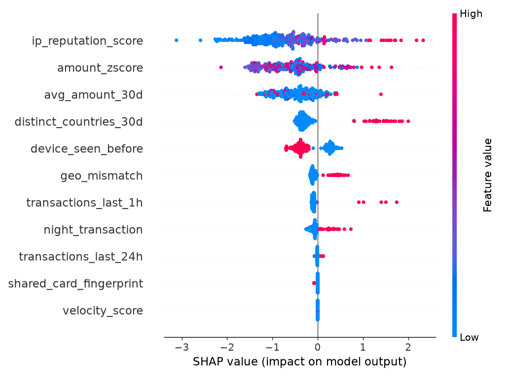
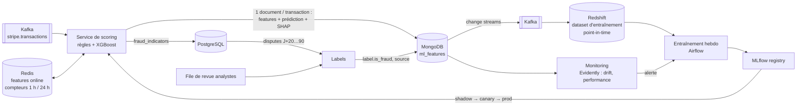

# 07 — Intégration du Machine Learning

> Livrable 7 : *Machine Learning Integration Strategy* — intégration des modèles avec le NoSQL, détection de fraude temps réel, personnalisation, analyse prédictive, extraction de features, déploiement, monitoring et mise à jour des modèles.

Démo exécutable : [`ml/train_fraud_demo.py`](../ml/train_fraud_demo.py) entraîne un XGBoost sur les features synthétiques, mesure l'AUC-PR, produit les explications SHAP et enregistre le modèle dans MLflow (local). Résultats sur le jeu de démo (1 041 transactions, 8,5 % de fraude) : **AUC-PR 0,43** (baseline aléatoire 0,09), AUC-ROC 0,78 ; précision de 67 % sur `block`, 37 % sur `review`, 5 % sur `allow` — le modèle est calibré, la politique d'action fonctionne ([`ml/output/metrics.json`](../ml/output/metrics.json)).



Requêtes associées : NoSQL Q3 (explicabilité), Q6 (qualité sur labels), Q9 (écriture atomique) dans [08_queries.md](08_queries.md).

---

## 1. Trois cas d'usage

| Modèle | Question | Type | Latence | Features | Sortie |
|---|---|---|---|---|---|
| **Détection de fraude** | Cette transaction est-elle frauduleuse ? | Classification binaire (XGBoost) + règles | **< 200 ms P95**, synchrone à l'autorisation | Redis (online) + MongoDB `ml_features` | `fraud_probability`, `risk_level`, `action_taken`, SHAP → MongoDB + `fraud_indicators` (OLTP) |
| **Personnalisation** | Quelle méthode de paiement / offre proposer à ce segment chez ce merchant ? | Recommandation (LightFM / factorisation) | Batch nocturne | Redshift (transactions, segments) + MongoDB (`user_sessions`) | `recommendations` (MongoDB), servie par API |
| **Analyse prédictive** | Quel merchant va churner ? Quel volume demain ? | Classification (churn, XGBoost) + série temporelle (Prophet) | Hebdo / quotidien | Redshift (`fact_transactions`, `agg_daily_revenue`) | `ml_churn_predictions` (Redshift), prévisions de volume |

---

## 2. Rôle de MongoDB dans le cycle de vie ML

L'énoncé demande d'intégrer les modèles **« within the NoSQL system »**. MongoDB est le pivot du cycle, pas seulement un stockage :



| Fonction | Collection / mécanisme |
|---|---|
| **Feature store de référence** | `ml_features.features` : la valeur exacte de chaque feature au moment du scoring (reproductibilité, audit) |
| **Journal de prédictions** | `ml_features.prediction` : probabilité, niveau, action, version du modèle, latence, `top_shap` |
| **Labels retardés** | `ml_features.label` : `is_fraud`, `source` (`chargeback`, `dispute_won`, `analyst_review`, `matured_no_dispute`), `labeled_at` |
| **Explicabilité** (RGPD art. 22) | `top_shap` par prédiction, requêtable (NoSQL Q3) |
| **Écriture atomique** | Transaction multi-documents `ml_features` + `fraud_alerts` (NoSQL Q9) |
| **Sortie du modèle de personnalisation** | `recommendations` (1 document / merchant / mois), servie par `GET /recommendations/{merchant_id}` |
| **Métadonnées de modèles** | `model_registry_metadata` : version, métriques, dataset, date de promotion (miroir de MLflow, requêtable avec les prédictions) |
| **Exécution dans le NoSQL** | Atlas Triggers pour recalculer un agrégat de features à l'insertion ; **Atlas Vector Search** pour la personnalisation par embeddings (similarité de comportement de session) |

---

## 3. Détection de fraude en temps réel

### 3.1 Hybride règles + modèle + humain

```
Transaction (Kafka)
   │
   ├─► Règles dures (< 5 ms)     : liste noire IP / fingerprint, pays sanctionnés, > 20 tentatives/h → block immédiat
   │
   ├─► Modèle XGBoost (< 20 ms)  : fraud_probability
   │
   └─► Politique d'action        : probabilité → action, ajustable sans réentraîner
            < 0.30  allow
            < 0.60  challenge_3ds   (authentification forte, PSD2)
            < 0.85  review          (file de revue analystes, décision sous 2 h)
            ≥ 0.85  block
```

Les règles couvrent ce que le modèle ne peut pas apprendre (sanctions, listes) ; le modèle couvre les motifs subtils ; l'humain traite la zone grise et **produit des labels** (`analyst_review`).

### 3.2 Features et feature store online / offline

| Feature | Calcul | Store online (Redis) | Store offline (Redshift) |
|---|---|---|---|
| `transactions_last_1h`, `_24h` | Compteur glissant par client | `INCR` + `EXPIRE` à chaque transaction (< 1 ms) | Window function sur `fact_transactions` |
| `velocity_score` | `min(1, last_1h / 5)` | dérivé | dérivé |
| `amount_zscore` | (montant − moyenne devise) / écart-type | constantes en cache | `AVG/STDDEV` par devise |
| `avg_amount_30d`, `distinct_countries_30d` | Agrégat 30 j par client | Recalcul quotidien (Airflow) → Redis | dbt |
| `geo_mismatch` | pays IP ≠ pays client | direct | direct |
| `night_transaction` | heure locale < 6 h | direct | direct |
| `device_seen_before` | (client, device) déjà vu | `SADD/SISMEMBER` | historique |
| `shared_card_fingerprint` | fingerprint sur > 1 compte | set Redis | OLTP Q6 |
| `ip_reputation_score` | API externe (MaxMind / AbuseIPDB) | cache TTL 24 h | snapshot quotidien |

**Training/serving skew** : la même définition de feature est écrite **une seule fois** (dbt pour l'offline, et une bibliothèque Python partagée pour l'online, testée contre dbt sur un échantillon quotidien — écart toléré < 0,1 %). Le dataset d'entraînement est construit **point-in-time** : pour chaque transaction, les features telles qu'elles étaient *à cet instant* (c'est pour cela que `ml_features` fige les valeurs), jamais recalculées après coup avec de l'information future.

### 3.3 Budget de latence (< 200 ms P95)

| Étape | Budget | Levier |
|---|---|---|
| Consommation Kafka | 20 ms | consumer dédié, `fetch.min.bytes` bas |
| Lecture features Redis (pipeline de 6 commandes) | 5 ms | `MGET`, connexion persistante |
| Règles dures | 5 ms | en mémoire |
| Inférence XGBoost (200 arbres) | 10 ms | modèle chargé au démarrage, `predict` sur 1 ligne |
| SHAP (TreeExplainer, top 3) | 15 ms | calcul asynchrone si > budget : la décision part, l'explication suit |
| Écriture MongoDB (`w: majority`) | 20 ms | transaction multi-documents uniquement pour critical |
| Écriture `fraud_indicators` (OLTP) | 10 ms | asynchrone via Kafka si l'OLTP est lent |
| Réseau, sérialisation | 30 ms | mêmes AZ |
| **Total nominal** | **~115 ms** | marge pour le P95 |

**Dégradation gracieuse** : si le scoring dépasse 200 ms ou est indisponible, la transaction reçoit `risk_level = unknown`, passe **par les règles dures seules** et est scorée a posteriori pour la revue. On ne bloque jamais un paiement parce qu'un service ML est lent.

### 3.4 Algorithme et métrique

**XGBoost** : performant sur données tabulaires déséquilibrées, gère les valeurs manquantes, rapide à l'inférence, explicable par SHAP.

```python
XGBClassifier(n_estimators=200, max_depth=6, learning_rate=0.05,
              scale_pos_weight=neg/pos,     # ré-équilibrage de la classe minoritaire
              eval_metric="aucpr")           # AUC-PR, pas AUC-ROC
```

**AUC-PR** plutôt qu'AUC-ROC : avec < 1 % de fraude en production, un modèle qui dit toujours « non » a une AUC-ROC flatteuse ; l'AUC-PR mesure ce qui compte — la précision sur les positifs rares. Métriques de promotion : AUC-PR, **recall à précision fixée** (ex. recall@precision = 0,9), taux de faux positifs (coût commercial : un client légitime bloqué).

---

## 4. La boucle de feedback et le label delay

C'est le point le plus souvent oublié — et le plus important — d'un système de fraude.

| Source de label | Quand | Fiabilité | Biais |
|---|---|---|---|
| **Chargeback** (`disputes.status = lost`) | **J+20 à J+90** après la transaction | Élevée (vérité terrain financière) | N'existe que pour les transactions **acceptées** : une transaction bloquée n'est jamais contestée → jamais labellisée par cette voie |
| Dispute gagné (`won`) | J+35 à J+135 | Élevée | idem |
| **Revue analyste** (`analyst_review`) | J+1 à J+5 sur les `review` / `block` | Bonne | Corrige le biais précédent : c'est la seule façon de savoir si un blocage était justifié |
| Maturité sans dispute (`matured_no_dispute`) | J+120 | Bonne (négatif) | — |

Conséquences architecturales :
- Le dataset d'entraînement n'inclut que les transactions **matures** (≥ 120 jours) ou labellisées par un analyste ; les 4 derniers mois servent à la validation « en attente ».
- Le monitoring de performance (§6) se calcule sur les données matures ; le court terme s'appuie sur des **proxies** : taux de blocage, taux de 3DS échoués, volume de la file de revue, taux d'accord analyste/modèle.
- Le jeu de démo reproduit ce mécanisme : `generate_data.py` crée les disputes avec un délai de 20-90 jours et des labels de revue ; NoSQL Q6 montre la précision par niveau de risque (75 % sur `critical`, 4 % sur `low`).

---

## 5. Déploiement : shadow → canary → production

```
MLflow registry
   Staging  ──► Shadow (100 % du trafic scoré, 0 % d'effet ; comparaison décision par décision)
            ──► Canary 5 % (A/B : le challenger décide sur 5 % des merchants)
            ──► Production (champion) ──► Archived
```

| Étape | Critère de passage | Rollback automatique si |
|---|---|---|
| Staging → Shadow | AUC-PR ≥ champion sur le dataset mature ; tests unitaires de features | — |
| Shadow → Canary | Taux d'accord ≥ 95 % ; désaccords revus par les analystes ; latence P95 < 150 ms | — |
| Canary → Prod | 2 semaines : recall proxy ≥ champion, faux positifs ≤ champion + 0,2 pt, validation équipe risque | P95 > 200 ms, taux de blocage ± 50 % vs champion, erreurs > 0,1 % |

Chaque prédiction porte `model_version` : on peut comparer champion et challenger **après coup** sur les labels matures (NoSQL : `$group` par `prediction.model_version`).

---

## 6. Monitoring et mise à jour des modèles

### 6.1 Trois types de dérive

| Dérive | Définition | Mesure (Evidently AI, quotidien) | Action |
|---|---|---|---|
| **Data drift** | La distribution des features change (nouveau type de device, nouveau marché) | PSI / KS par feature vs fenêtre d'entraînement | > 3 features en dérive → réentraînement anticipé |
| **Concept drift** | La relation features → fraude change (nouveau schéma de fraude) | Précision / recall sur labels matures, taux d'accord analystes, taux de disputes sur `allow` | Réentraînement + revue des règles |
| **Performance drift** | Le service se dégrade | Latence P95, erreurs, prédictions manquantes | Alerte ops, rollback |

### 6.2 Tableau de bord

| Métrique | Fréquence | Seuil d'alerte |
|---|---|---|
| Recall sur fraudes confirmées (matures) | quotidien | < 0,80 |
| Précision par niveau de risque | quotidien | `critical` < 0,70 |
| Taux de blocage, taux de 3DS, taille de la file de revue (proxies) | temps réel | ± 50 % vs J-7 |
| Faux positifs signalés par le support | quotidien | > 2 % |
| Latence P95 scoring | temps réel | > 200 ms |
| Taux de prédictions manquantes / fallback | temps réel | > 0,1 % |
| **Équité** : taux de blocage par pays, device, segment | hebdo | écart > 2× sans justification métier |

### 6.3 Réentraînement

DAG `weekly_ml_retrain` (lundi 03:00) ou déclenché par une alerte de dérive :

```
Extraction point-in-time (Redshift + ml_features, 6 mois, labels matures)
   → feature engineering (même code que l'online)
   → entraînement XGBoost + calibration (isotonic)
   → évaluation : AUC-PR, recall@precision=0.9, équité par segment
   → AUC-PR ≥ champion ?  oui → MLflow Staging → shadow (§5)
                          non → alerte équipe ML, champion conservé
```

Hyperparamètres, dataset (hash), métriques et artefact sont versionnés dans MLflow ; la reproduction d'un modèle de production est un `mlflow run` à partir de son ID.

---

## 7. Personnalisation (batch)

- **Interaction** : matrice `client × méthode de paiement` (et `client × merchant`), pondérée par la conversion (`user_sessions.converted`) et le montant.
- **Modèle** : factorisation (LightFM) avec features de contenu (segment, pays, device) pour le **cold start** : un nouveau client reçoit la recommandation de son segment.
- **Pipeline** (Airflow nocturne) : Redshift (12 mois de faits + `dim_customer.segment`) ⨝ MongoDB `user_sessions` (change streams → Redshift `fact_sessions`) → entraînement → top-3 par merchant × segment → `recommendations` (MongoDB) → API.
- **Évaluation** : uplift de conversion en A/B par merchant ; les recommandations portent `model_version` et `confidence`.
- **Évolution** : embeddings de sessions + **Atlas Vector Search** pour recommander « les clients qui vous ressemblent ont converti avec… ».

---

## 8. Analyse prédictive

### Churn merchant (hebdo)

- Définition : aucun paiement `succeeded` pendant 30 jours consécutifs.
- Features (Redshift) : `transactions_last_30d/90d`, pente du revenu 90 j (`agg_daily_revenue`), `failure_rate_7d`, `days_since_last_transaction`, ancienneté, `dispute_rate`, NPS moyen (`customer_feedback` via change streams).
- Sortie : `ml_churn_predictions (merchant_sk, prediction_date, churn_probability, risk_category)` → dashboard commercial, alertes account managers.

### Prévision de volume (quotidien)

- Série `agg_daily_revenue` agrégée par région et par jour ; **Prophet** (saisonnalité hebdomadaire / annuelle, jours fériés depuis `dim_date.is_holiday`).
- Usages : capacity planning (partitions Kafka, scaling scoring), détection d'anomalie de volume (écart > 3σ vs prévision → alerte fraude massive ou incident).

---

## 9. Gouvernance ML

| Sujet | Réponse |
|---|---|
| Explicabilité | SHAP par prédiction, stocké et exposé aux analystes et au client contestataire (art. 22) |
| Équité | Monitoring hebdo par pays / device / segment ; DPIA du scoring |
| Reproductibilité | Features figées dans `ml_features`, dataset hashé, MLflow |
| Sécurité | Le service de scoring ne voit ni email ni PAN ; features pseudonymisées ; modèle signé dans le registry |
| Coût | Inférence CPU (XGBoost) ; pas de GPU nécessaire ; autoscaling sur le lag Kafka |
