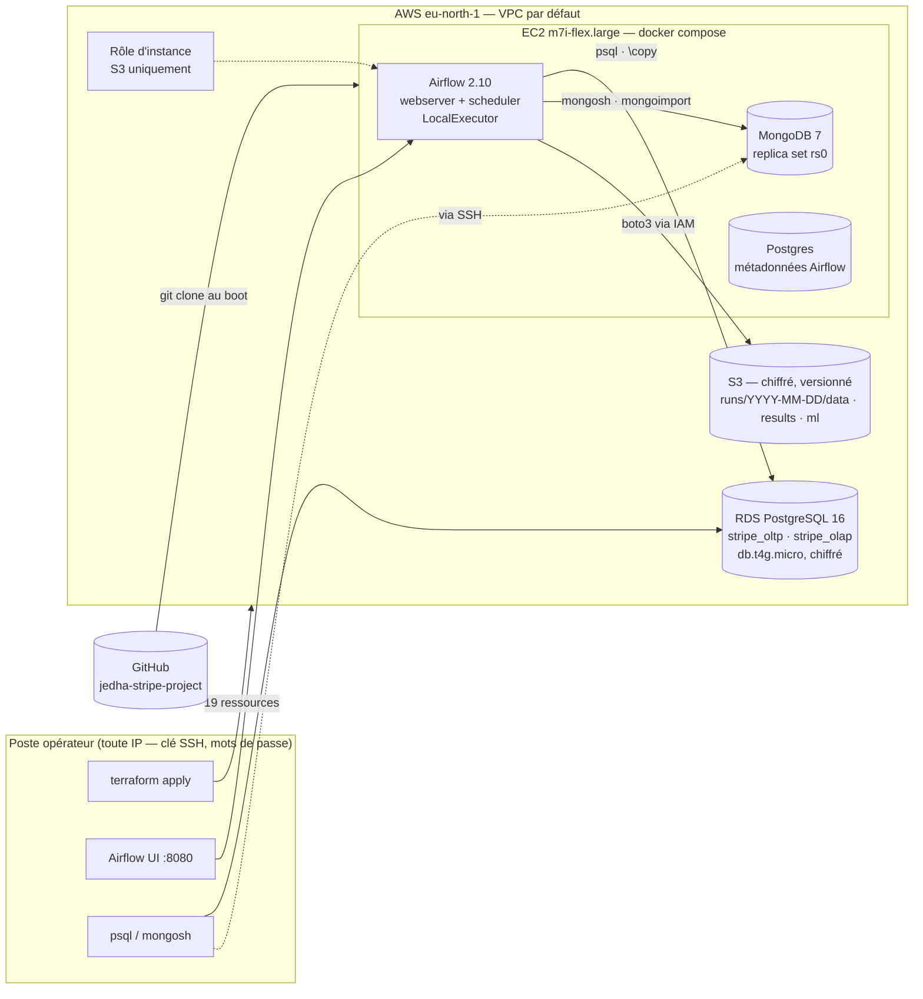

# 10 — Déploiement en production (AWS)

> Le pipeline tourne dans le cloud : infrastructure déclarée en Terraform, orchestration Airflow, bases managées et données archivées dans S3. Ce document décrit ce qui est déployé, comment le reproduire et ce qui diffère de la cible de conception.

- Infrastructure : [`infra/terraform/`](../infra/terraform/) (`main.tf`, `variables.tf`, `outputs.tf`, `user_data.sh`)
- Orchestration : [`deploy/airflow/`](../deploy/airflow/) (`docker-compose.yml`, `Dockerfile`, `dags/stripe_pipeline.py`)
- Région : **eu-north-1 (Stockholm)** — résidence des données UE, cohérente avec [06_security_compliance.md](06_security_compliance.md) §10

---

## 1. Architecture déployée



| Brique | Cible de conception ([01](01_architecture.md)) | Déployé | Écart |
|---|---|---|---|
| OLTP | PostgreSQL 16 | **RDS PostgreSQL 16**, base `stripe_oltp`, chiffrement at-rest, `rds.logical_replication = 1` (prêt pour Debezium) | Mono-AZ (variable `rds_multi_az = true` pour le standby synchrone) |
| OLAP | Amazon Redshift | **Même instance RDS**, base `stripe_olap` : star schema, vue matérialisée, index B-tree | Redshift non activable sur le compte (inscription incomplète) ; même modèle, mêmes requêtes, `DISTKEY`/`SORTKEY` en commentaires du DDL |
| NoSQL | MongoDB 7 shardé | **MongoDB 7** replica set mono-nœud sur l'EC2 (transactions et change streams actifs) | Équivalent managé : Atlas M0 sur AWS |
| Streaming | Debezium + Kafka | — | Palier suivant : Redpanda + Debezium dans le même compose (RDS déjà configuré) |
| Staging / archivage | S3 → COPY Redshift | **S3** : données générées, résultats des 30 requêtes, artefacts ML, par run | Chargement par `\copy` client (RDS ne lit pas S3 directement) |
| Orchestration | Airflow | **Airflow 2.10** (LocalExecutor), DAG quotidien 02:00 UTC + déclenchement manuel | dbt non déployé (modèles fournis dans `pipeline/dbt/`, `build_olap.py` joue leur rôle) |
| IaC | Terraform | **Terraform 1.9** — 19 ressources | — |
| Secrets | Secrets Manager | Mot de passe RDS et admin Airflow générés par Terraform, écrits dans un `.env` sur l'instance (`chmod 600`), jamais dans le dépôt | Secrets Manager en cible |
| Accès | VPC privé, bastion | SSH (clé ED25519 générée), Airflow (mot de passe généré) et RDS (mot de passe 24 car., chiffré) ouverts — l'IP de l'opérateur varie ; `operator_cidr` permet de restreindre. **MongoDB n'est pas exposé** (pas d'authentification) : accès via SSH | — |

---

## 2. Le DAG `stripe_pipeline`

```
generate_data ─┬─► build_olap ─► init_databases ─► load_oltp ─► load_olap ─┐
               ├─► init_mongo ─► load_mongo ────────────────────────────────┼─► quality_checks ─┬─► queries_oltp  ─┐
               └─► train_fraud_model ──────────────────────────────────────┐│                   ├─► queries_olap  ─┼─► upload_to_s3 ─► summary
                                                                           └┴───────────────────└─► queries_nosql ─┘
```

| Tâche | Ce qu'elle fait | Durée typique |
|---|---|---|
| `generate_data` | `generate_data.py --seed {{ ds_nodash }}` : nouveau jeu chaque jour, dates relatives | 2 s |
| `build_olap` | Star schema (SK, SCD2, `amount_usd`, agrégats) — rôle de dbt | 12 s |
| `init_databases` | Crée `stripe_oltp` / `stripe_olap` si absentes | 1 s |
| `load_oltp`, `load_olap` | DDL complet (partitions, index, triggers, MV) puis `\copy` de tous les CSV | 3 s |
| `init_mongo`, `load_mongo` | Replica set, time-series, validators, index ; `mongoimport` des 5 collections | 10 s |
| **`quality_checks`** | **10 contrôles bloquants**, dont 3 **inter-systèmes** : `count(fact) = count(transactions)`, `count(ml_features) = count(transactions)`, aucun email en clair dans l'OLAP, une seule version SCD2 courante par merchant, fraude dans les bornes, dates Mongo en BSON Date | 2 s |
| `queries_oltp/olap/nosql` | Les 30 requêtes exécutées sur les cibles de production, sorties archivées | 3 s |
| `train_fraud_model` | XGBoost + SHAP + métriques | 12 s |
| `upload_to_s3` | Données, résultats, artefacts ML → `s3://…/runs/<date>/` (rôle d'instance, aucune clé) | 2 s |
| `summary` | Bilan du run dans les logs | — |

Run complet : **≈ 25 secondes**. `retries = 2`, `max_active_runs = 1`, `catchup = False`.

Le contrôle `quality_checks` est l'équivalent déployé des tests dbt de [`pipeline/dbt/models/marts/schema.yml`](../pipeline/dbt/models/marts/schema.yml) : un contrôle rouge arrête le DAG avant les requêtes et l'archivage.

---

## 3. Reproduire

Prérequis : un compte AWS avec les droits EC2, RDS, S3, IAM ; la CLI AWS configurée (`aws configure`) ; Docker (Terraform s'exécute dans un conteneur, voir ci-dessous).

```bash
bash infra/terraform/tf.sh init
bash infra/terraform/tf.sh apply          # ≈ 8 min (RDS), puis 5 min de cloud-init sur l'EC2
bash infra/terraform/tf.sh output         # airflow_url, ssh, rds_endpoint, s3_bucket
bash infra/terraform/tf.sh output -raw airflow_login
```

Au premier démarrage l'instance installe Docker, clone `main`, écrit `.env` et lance `docker compose up`. Le DAG est planifié à 02:00 UTC ; pour un run immédiat : Airflow UI → *Trigger DAG*, ou

```bash
ssh -i infra/terraform/keys/stripe-pipeline.pem ubuntu@<ip> \
  'cd /opt/stripe/deploy/airflow && sudo docker compose exec airflow-scheduler airflow dags trigger stripe_pipeline'
```

Mettre à jour le code déployé : `git pull` dans `/opt/stripe` (le DAG est relu toutes les 30 s ; `docker compose build && up -d` seulement si `Dockerfile` ou `requirements.txt` changent).

**Arrêt** : `bash infra/terraform/tf.sh destroy` — supprime les 19 ressources, y compris le bucket (`force_destroy`).

### Pourquoi `tf.sh` (Terraform dans Docker)

Sous Windows avec un antivirus qui intercepte le TLS, Terraform ne peut pas dialoguer avec ses providers (handshake mTLS local rejeté : *certificate signed by unknown authority*). Le script exécute `hashicorp/terraform:1.9` dans un conteneur, monte `~/.aws` en lecture seule et ajoute le certificat de l'antivirus au bundle du conteneur pour les appels sortants. Sous macOS/Linux, `terraform` natif fonctionne aussi.

---

## 4. Coût

| Ressource | Tarif eu-north-1 | Par jour |
|---|---|---|
| EC2 `m7i-flex.large` (éligible free tier) | ~0,10 $/h | ~2,4 $ |
| RDS `db.t4g.micro` + 20 Go gp3 | ~0,018 $/h | ~0,5 $ |
| S3 (< 100 Mo, versionné) | — | < 0,01 $ |
| **Total** | | **≈ 3 $/jour** — à détruire après la soutenance |

Redshift Serverless ajouterait ~3 $/h pendant les requêtes (pause automatique sinon).

---

## 5. Sécurité du déploiement

- Aucune clé AWS dans le code ni sur l'instance : l'accès S3 passe par le **rôle d'instance** (IMDSv2, `hop_limit = 2` pour les conteneurs).
- Mots de passe RDS et Airflow **générés** par Terraform (`random_password`), stockés dans l'état Terraform (local, gitignoré) et dans `.env` sur l'instance.
- Clé SSH générée par Terraform, écrite dans `infra/terraform/keys/` (gitignoré).
- Security groups : SSH, Airflow (8080) et RDS (5432) ouverts par défaut (`operator_cidr = 0.0.0.0/0`, l'IP de l'opérateur change) — chacun protégé par clé ou mot de passe généré ; **MongoDB (27017) n'est pas exposé** : `mongosh` via SSH sur l'instance. Restreindre avec `operator_cidr = "x.x.x.x/32"` si l'IP est stable.
- Chiffrement at-rest : RDS, volume EC2, S3 (AES-256) ; versioning S3 activé.
- Le bucket bloque tout accès public.

---

## 6. Ce que la vidéo montre

1. `terraform output` — les ressources existent.
2. Airflow UI : le DAG `stripe_pipeline`, *Trigger DAG*, la vue Graph qui passe au vert en ~25 s.
3. Le log de `quality_checks` : 10 contrôles, dont la cohérence OLTP ↔ OLAP ↔ NoSQL.
4. Le log de `summary`.
5. Console AWS : RDS (instance `stripe-pipeline-postgres`), S3 (`runs/<date>/results/olap_results.txt`).
6. Depuis le poste : une requête `psql` sur RDS (OLAP Q9, SCD2) ; via SSH sur l'EC2 : `mongosh` (NoSQL Q6).
